## Java IO

---
### IO
* Input & Output
* 입출력
* 임력은 키보드, 네트워크, 파일 등으로 부터 받을 수 있다.
* 출력은 화면, 네트워크, 파일 등에 할 수 있다.

---

### Java IO도 객체
* Java IO 에서 사용되는 객체는 자바 세상에서 사용되는 객체이다.
* Java IO 가 제공하는 객체는 어떤 대상으로 부터 읽어들여, 어떤 대상에게 쓰는 일을 한다.

---
### Java IO는 조립되어 사용되도록 만들어짐
* Decorator 패턴(디자인 패턴 중 하나) 으로 만들어졌다.

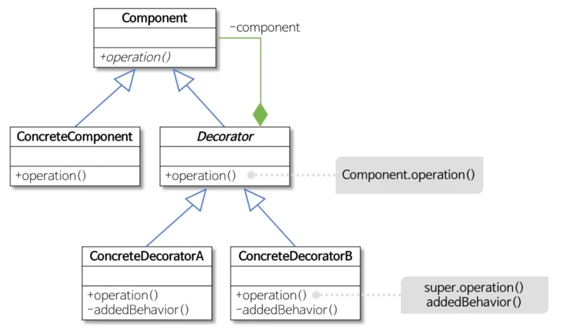

* Component 라는 부모클래스, 이를 상속받고 있는 ConcreteComponent(주인공), Decortator(장식)
* 초록색 화살표로 되있는 것 → Decortator는 component 역할을 수행하는 것들을 가질 수 있다 라는 뜻 </br>
( = Component 클래스를 상속받고 있는 것들도 가질 수 있다)

### 주인공과 장식을 구분할 수 있어야 함
* 장식은 InputStream, OutputStream, Reader, Writer를 생성자에서 받아들인다.</br>
  (위 4개 클래스는 Decorator 패턴에서 Component 역할을 수행, 추상클래스로 new로 인스턴스 생성 불가)
* 주인공은 어떤 대상에게서 읽어들일지, 쓸지를 결정한다.
* 주인공은 1byte 또는 byte[] 단위로 읽고 쓰는 메소드를 가진다.
* 주인공은 1char 또는 char[] 단위로 읽고 쓰는 메소드를 가진다.
* 장식은 다양한 방식으로 읽고 쓰는 메소드를 가진다.

---

### Java IO의 특수한 객체
* System.in : 표준 입력 (InputStream)
* System.out : 표준 출력 (PrintStream)
* System.err : 표준 에러 출력 (PrintStream)

--- 

### Java IO의 클래스 상속도
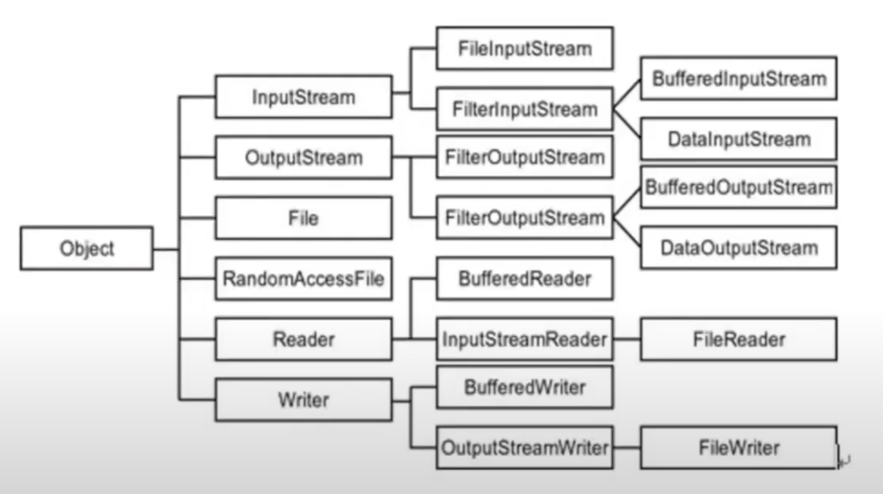

* InputStream, OutputSteram, Reader, Writer 4가지 추상 클래스가 중요!
* 4가지 추상 클래스를 각각 상속받고 있는 클래스들로 구성되어 있음
* 이 중에선 주인공 역할을 수행하는 것이 있고 장식 역할을 수행하는 것이 있다.

___

### Java IO 클래스 이름이 중요
| 클래스                    | 설명                                                                                         |
|------------------------|--------------------------------------------------------------------------------------------|
| Stream로 끝남             | byte 단위 입출력 클래스                                                                            |
| InputStream로 끝남        | byte 단위로 입력을 받는 클래스                                                                        |
| OutputStream로 끝남       | byte 단위로 출력을 하는 클래스                                                                        |
| Reader로 끝남             | 문자 단위로 입력을 받는 클래스                                                                          |
| Writer로 끝남             | 문자 단위로 출력을 하는 클래스                                                                          |
| File로 시작 (File 클래스 제외) | File로부터 입력이나 출력을 하는 클래스                                                                    |
| ByteArray로 시작          | 입력 클래스의 경우 byte 배열로부터 읽어들이고, 출력 클래스의 경우 클래스 내부의 자료구조에 출력을 한 후 출력된 결과를 byte 배열로 반환하는 기능을 가짐 |
| CharArray로 시작          | 입력 클래스의 경우 char 배열로부터 읽어들이고, 출력 클래스의 경우 클래스 내부의 자료구조에 출력을 한 후 출력된 결과를 char 배열로 반환하는 기능을 가짐 |
| Filter로 시작             | Filter로 시작하는 입출력 클래스는 직접 사용하는 것보다 상속받아 사용을 하며, 사용자가 원하는 내용만 필터링할 목적으로 사용됨                  |
| Data로 시작               | 다양한 데이터 형을 입출력 할 목적으로 사용. 특히 기본형 값(int, float, double 등)을 출력하는데 유리                         |
| Buffered로 시작           | 프로그램에서 Buffer라는 말은 메모리를 의미. 입출력 시에 병목현상을 줄이고 싶을 경우 사용                                      |
| RandomAccessFile       | 입력이나 출력을 모두 할 수 있는 클래스로써, 파일에서 임의의 위치의 내용을 읽거나 쓸 수 있는 기능을 제                                |

---

### Java IO 클래스는 생성자가 중요!!
* 장식은 InputStream, OutputStream, Reader, Writer를 생성자에서 받아들인다.

Java api java.io 검색 후 공식문서 들어가서 Frames 클릭 → java.io 패키지 접속</br>
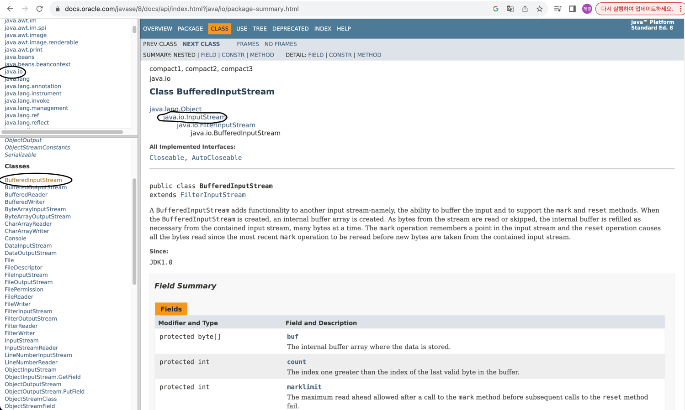
BufferedInputStream 들어가 보면 InputStream을 상속받는 것을 알 수 있음
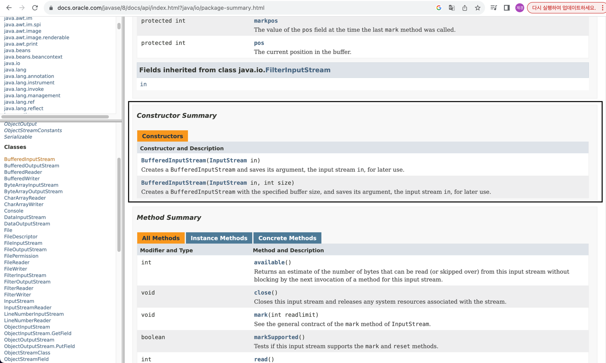
생성자를 보면 InputStream을 받아들이는 것을 알 수 있다.</br>
**InputStream, OutputStream, Reader, Writer를 생성자에서 받아들이는 클래스는 전부 다 장식 역할**</br>
**InputStream, OutputStream, Reader, Writer를 생성자에서 받아들이지 않는 클래스는 전부 다 주인공 역할**</br>
File 클래스는 Java IO에서 File 클래스 자체일 뿐 읽고 쓰기 위한 클래스가 아님 (Decorator 패턴 적용 ❌)

***Java IO는 상속관계와 생성자를 잘 보는 것이 중요하다!!***

---

### Java IO를 잘 다루려면, API를 한번쯤은 읽어봐야 함

문제) 키보드로부터 한 줄씩 입력받아 화면에 한 줄씩 출력하시오.

다음과 같은 문제를 해결하려면❓

```java
public class KeyboardIOExam {
    public static void main(String[] args) throws Exception{
        // 이렇게 JVM에게 Exception을 떠넘기는 건 좋지 않지만 코드를 간단하게 적기 위해 작성 
        
        // 키보드로부터 한 줄씩 입력받고, 한 줄씩 화면에 출력하시오.
        // 키보드 : System.in (InputStream 주인공)
        // 화면에 출력 : System.out (OutputStream 주인공)
        // 키보드로 입력받는다는 것은 문자를 입력받는 것 : char 단위 입출력
        // char 단위 입출력 클래스 : Reader, Writer
        // 한 줄 읽기 : BufferedReader 라는 클래스는 readLine 이라는 메소드를 가지고 있다.
        //            더 이상 읽어들일 것이 없으면(EOF) null을 반환
        //            장식!
        // 한 줄 쓰기 : PrintStream, PrintWriter


        // BufferedReader는 장식 역할을 수행하기 때문에 생성자로 Reader를 받아들여야 함 → Reader는 추상클래스라 그냥 받지 못하고 자손클래스를 받아야 함❗️
        
        // BufferedReader 생성자로 올 수 있는 목록 (
        // BufferedReader → 🚫
        // CharReader → 문자로부터 읽어들이므로 🚫
        // FilterReader → 장식이라 Reader를 넣어줘야 하므로 🚫
        // InputStreamReader(InputStream in) → 장식 ✅
        BufferedReader br = new BufferedReader(new InputStreamReader(System.in));
        
        String line = null; // line 이라는 변수 선언
        while ( (line = br.readLine()) != null) {// 한 줄 입력받아서 line 변수에 넣어주는데 null이 아닐 때까지 반복하라 command + D 프로그램 종료
          System.out.println("읽어들인 값 :" + line);
        }
    }
}
```
키보드는 System.in → InputStream 타입이며</br>
InputStreamReader(InputStream in) 은 InputStream을 받아들이므로</br>
BufferedReader 의 생성자 안에 들어갈 수가 있다!
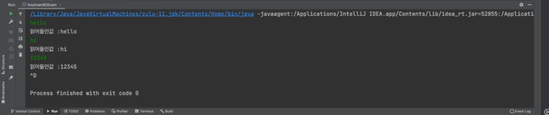
* 순서

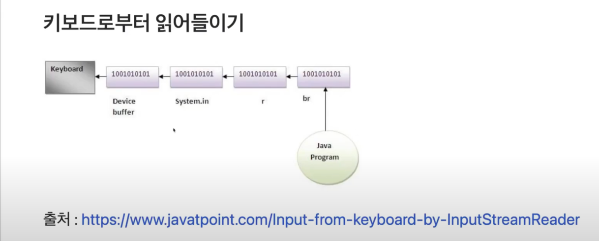
값을 입력하면 System.in 이 읽어들이고, 읽어들인 것을 InputStreamReader한테 전달하며 이걸 또 BufferedReader에게 전달하며 문자열로 리턴해주는 순서로 구성

***Java IO 가 제공해주는 클래스를 적절하게 이용하게 되면 적절하게 다양한 곳에 유용하게 쓸 수가 있다!!***

---

### File 클래스

* java.io.File 클래스는 파일의 크기, 파일의 접근 권한, 파일의 삭제, 이름 변경 등의 작업을 할 수 있는 기능을 제공
* 주의해야할 사항은 디렉토리(폴더) 역시 파일로써 취급된다는 점

---

### File 클래스 생성자
| 클래스 생성자                           | 설명                                       |
|-----------------------------------|------------------------------------------|
| File(File parent, String child)   | parent 디렉토리에 child 라는 파일에 대한 File 객체를 생성 |
| File(String child)                | child 라는 파일에 대한 File 객체를 생성                     |
| File(String parent, String child) | parent 디렉토리에 child 라는 파일에 대한 File 객체를 생성                      |
* 파일 인스턴스를 만들었다고 해서 실제 폴더에 파일이 저장되는 것은 아니다!

---

### File 클래스의 중요 메소드
| File 클래스 메소드             | 설명                                            |
|--------------------------|-----------------------------------------------|
| boolean canRead()        | 파일이 읽기 가능할 경우(파일 커미션) true, 그렇지 않으면 false를 반환 |
| boolean canWrite()       | 파일이 쓰기 가능할 경우(파일 커미션) true, 그렇지 않으면 false를 반환 |
| boolean createNewFile()  | 지정한 파일이 존재하지 않을 경우 파일을 생성                     |
| boolean delete()         | 파일을 삭제. 디렉토리일 경우 비어있는 경우 삭제가 된다.              |
| void deleteOnExit()      | JVM(자바 가상 머신)이 종료될 때, 파일을 삭제                  |
| boolean exist()          | 파일이 존재할 경우 true, 그렇지 않을 경우 false를 반환          |
| String getAbsolutePath() | 파일의 절대 경로를 문자열로 반환                            |
| String getCanonicalPath() | 파일의 전체 경로를 문자열로 반환                            |
| String getName()         | 파일이나 디렉토리의 이름을 반환                             |
| String getParent()       | 부모 경로에 대한 경로명을 문자열로 반환                        |
| File getParentFile()     | 부모 디렉토리를 File의 형태로 반환                         |
| String getPath()         | 파일의 경로를 문자열의 형태로 반환                           |
| boolean isDirectory()    | 디렉토리일 경우 true, 그렇지 않을 경우 false를 반환            |

### 예제
1. FileInfo 클래스
```java
import java.io.File;
import java.io.IOException;

public class FileInfo {
    public static void main(String[] args) {
        if (args.length != 1) {
            System.out.println("사용법 : Java FileInfo 파일이름");
            System.exit(0); // return; 으로 적어줘도 됨
        } // if end

        File f = new File(args[0]);
        if (f.exist()) { // 파일이 존재할 경우
            System.out.println("length : " + f.length());
            System.out.println("canRead : " + f.canRead());
            System.out.println("canWrite : " + f.canWrite());
            System.out.println("getAbsolutePath : " + f.getAbsolutePath());
            
            try {
                System.out.println("getCanonicaPath : " + f.getCanonicaPath());
            } catch (IOException e) {
                System.out.println(e);
            }
            
            System.out.println("getName : " + f.getName());
            System.out.println("getParent : " + f.getParent());
            System.out.println("getPath : " + f.getPath());
        } else { // 파일이 존재하지 않을 경우
            System.out.println("파일이 존재하지 않습니다.");
        }
    } // main end
}
```
2. 출력 결과
```text
"사용법 : Java FileInfo 파일이름"
```
현재는 아규먼트가 0 이기 때문에 맨 위의 코드가 실행됨

여기서 아규먼트 값으로 . 을 넣어주게 되면
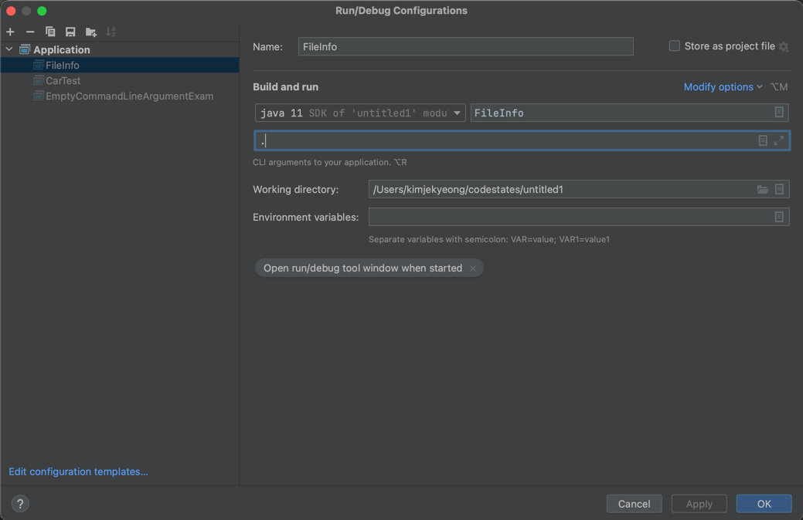

다음과 같이 출력이 되는 것을 볼 수 있다.
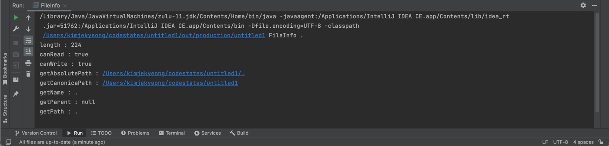
FileInfo 뒤에 . 이 붙은 것을 볼 수 있는데 여기서 . 은 현재 자바가 실행되는 경로를 말함.</br>
현재 리렉토리를 의미하므로 읽고 쓸 수 있다는 반환값 trueㅇ 출력하는 것을 볼 수 있다.


---

### Byte Stream
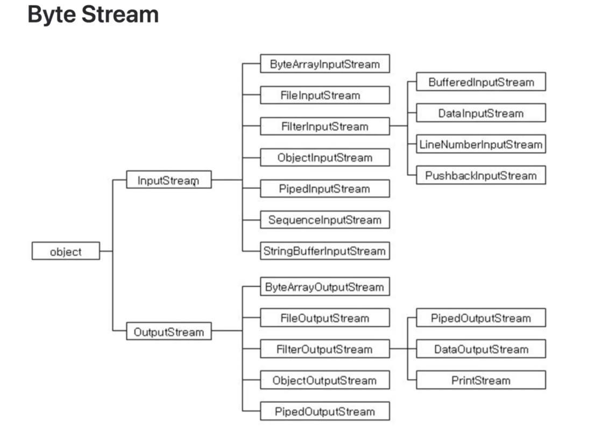

---

### InputStream, OutputStream
* 추상클래스
* byte 단위 입출력 클래스는 InputStream, OutputStream의 후손이다.

---

### InputStream 이 가지는 중요 메소드
| InputStream 클래스 메소드                        | 설명                                                                        |
|--------------------------------------------|---------------------------------------------------------------------------|
| int available() throws IOException         | 현재 읽을 수 있는 바이트 수를 반환                                                      |
| void close() throws IOException            | 입력 스트림을 닫음                                                                |
| int read() throws IOException              | 입력 스트림에서 한 바이트를 읽어서 int 값으로 반환. 더 이상 읽어들일 내용이 없을 경우 -1을 반환                |
| int read(byte buf[]) throws IOException    | 입력 스트림에서 buf[] 크기만큼을 읽어 buf에 저장하고 읽은 바이트 수를 반환. 더 이상 읽어들일 내용이 없을 경우 -1을 반환 |
| int skip(long numBytes) throws IOException | numBytes로 지정된 바이트를 무시하고, 무시된 바이트 수를 반환                                    |


### 예제

```java
/*
1byte가 표현할 수 있는 값 : 00000000 ~ 11111111
read() 메소드가 읽어들일 수 있는 정보 → 00000000 ~ 11111111 중에 한 개
1byte씩 읽어들인다. 100byte 파일을 읽는다 하면 100번 읽어들이는 것
만약 파일의 크기를 모른다면 ❓
→ 더 이상 읽어들일 것이 없을 떄(EOF)까지 1byte씩 읽어들일 것
❗️ 하지만 1byte가 표현할 수 있는 값으로는 EOF 값을 표현할 수 없다 
→ int(4byte)에 1byte 값을 담자 00000000 00000000 00000000 00000000
EOF : -1
*/
public class InputStream01 {
    public static void main(String[] args) {
        InputStream in = null;
        
        // in.read(); 이렇게만 적으면 IOException이 발생, 컴파일 오류가 발생 → Exception 처리 해줘야 함
      
        try {
            int data = in.read(); // int로 리턴하는 이유 ❓
        }catch (IOException ex){
            System.out.println("io 오류 : " + ex);
        }finally {
            try {
                in.close();
            }catch (Exception ex2){
                System.out.println("io 오류2 : " + ex2);
            }
        }
    }
}
```

InputStream의 주요 메소드는 `read()`</br>
`read()` 메소드는 추상메소드이기 때문에 자식에서 구현</br>
byte 단위로 읽어들이는 `read()` 메소드가 int로 리턴하는 이유 ❓</br>
→ ✅ EOF를 표현할 수 있는 방법이 없기 때문

---

### IO Stream

byte 또는 char의 흐름
<br/><br/>

---


### Reader, Writer
* 추상클래스
* char 단위 입출력 클래스는 Reader, Writer의 후손이다.

---

### Byte Input Stream Hierarchy

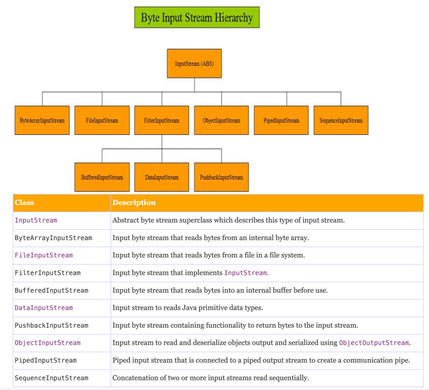

---

### Byte Output Stream Hierarchy

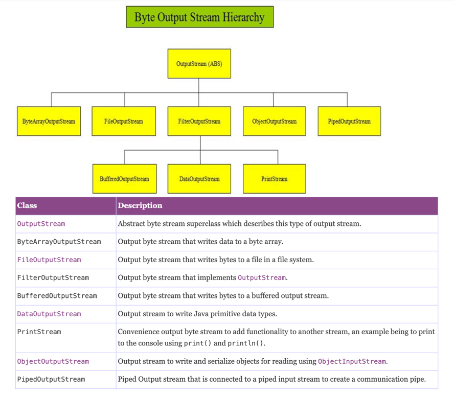

---

### Character Input Stream Hierarchy

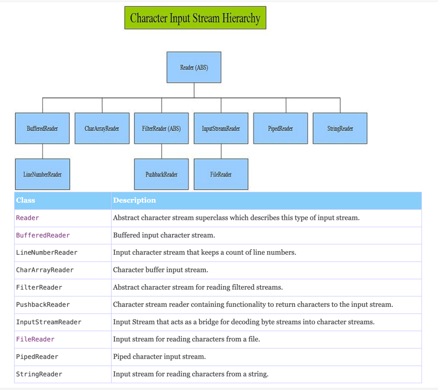

---

### Character Output Stream Hierarchy

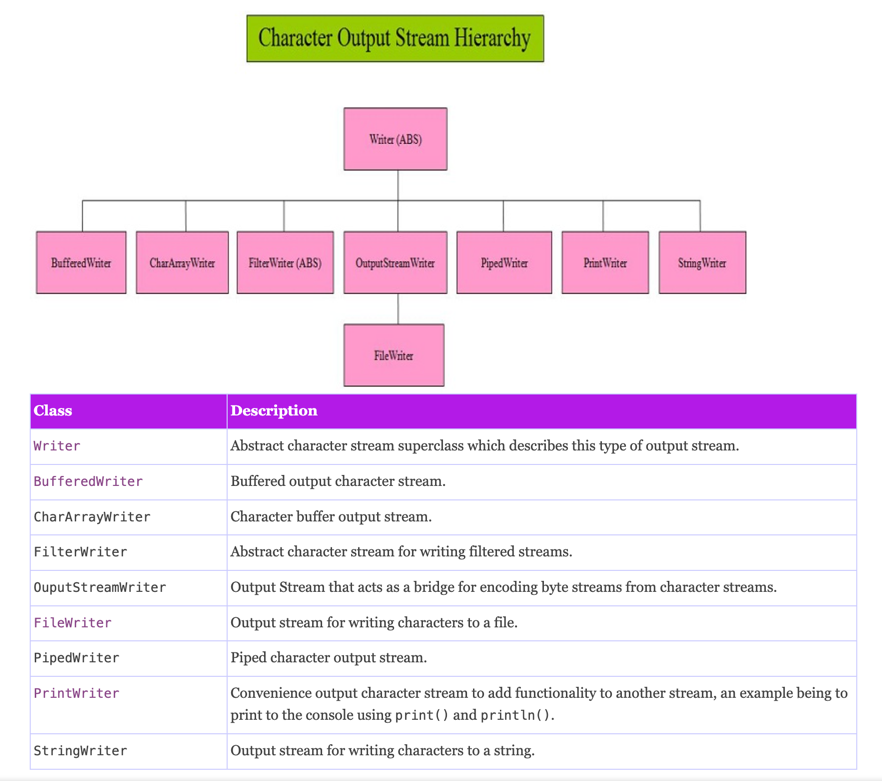

---

### InputStream 정리

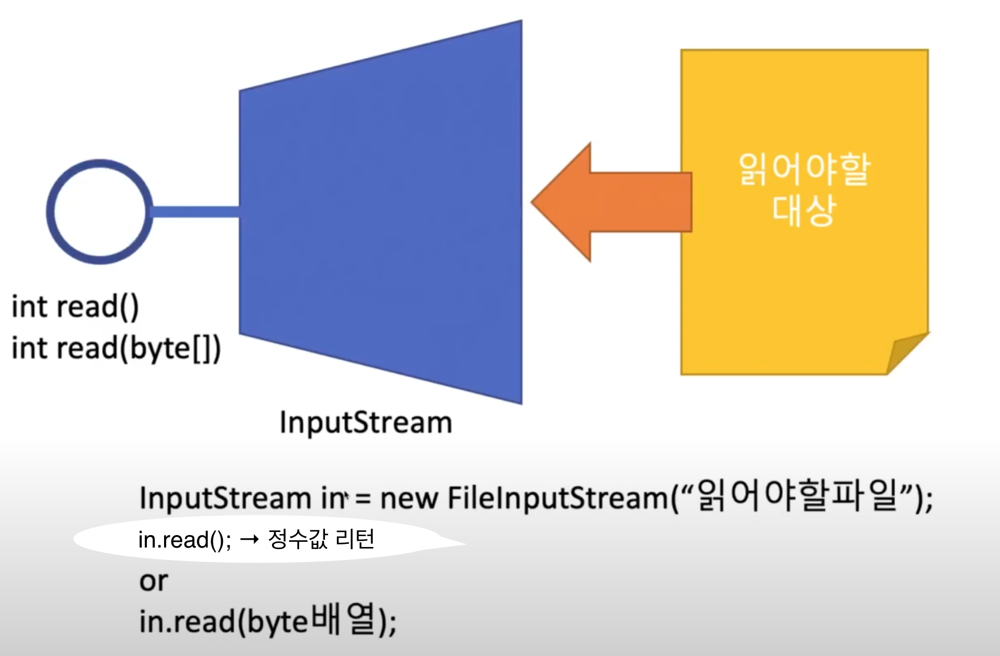
* InputStream 은 추상클래스이기 떄문에 new 연산자로 인스턴스를 생성할 수 없음!
* 읽어들여야 할 대상이 있는데 이를 읽어들이기 위해서는 InputStream을 이용하며 InputStream은 `read()` 라는 메소드를 갖고 있음.
* `read()` 라는 메소드는 byte 단위로 읽어들이는데 read() 메소드를 사용하게 되면 읽어들여야 할 대상으로부터 1byte씩 읽어들임.
* 1byte로 읽어들이는데 정수(4byte)로 리턴을 해줌. 4byte 중 맨 뒤 1byte에 읽어듥임.


---

### OutputStream 정리
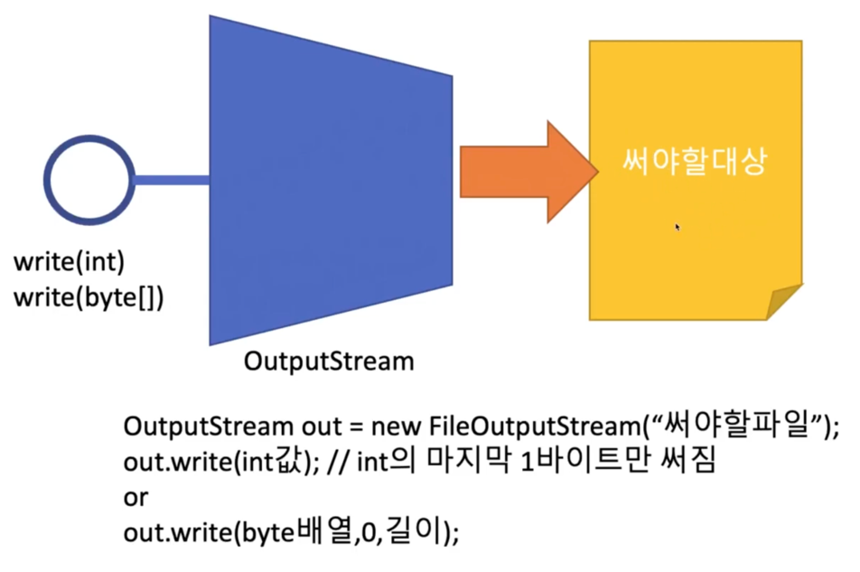

* InputStream 은 추상클래스이기 떄문에 new 연산자로 인스턴스를 생성할 수 없음!
* OutputStream이 갖고 있는 `write()` 메소드에 정수값을 넣어주면 정수의 맨 끝에 1byte가 써야 할 대상에 저장이 됨.
* `write()` 메소드를 10번 호출하면 써야 할 대상에 10byte가 차례대로 써짐.
* byte 배열을 넣어주게 되면 배열 크기만큼 써야 할 대상에 저장이 됨.

---

### 예제 1 (OutputStream)

```java
import java.io.FileOutputStream;
import java.io.OutputStream;

public class HelloIO01 {
  public static void main(String[] args) throws Exception {
        OutputStream out = new FileOutputStream("/tmp/helloio01.dat");
        out.write(1); // 0000 0000     0000 0000    0000 0000    0000 0001
        out.write(255);
        out.write(0);
        out.close();
    }
}
```
실행해보면 3byte짜리 파일이 저장이 된다.

---

### 예제 2 (InputStream)

```java
import java.io.FileInputStream;
import java.io.InputStream;

public class HelloIO02 {
    public static void main(String[] args) throws Exception {
        InputStream in = new FileInputStream("/tmp/helloio01.dat");
        int i1 = in.read(); // 정수(4byte) 중에서 맨 끝에 1byte에만 값을 채워서 읽어오게 되어있음
        System.out.println(i1); // 1
        int i2 = in.read();
        System.out.println(i2); // 255
        int i3 = in.read();
        System.out.println(i3); // 0
        int i4 = in.read();
        System.out.println(); // -1 (파일의 끝, 더 이상 읽어들일게 없으면 -1 리턴)
        in.close();
    }
}
```
실행 결과
```text
1
255
0
-1
```
### 예제 2 (InputStream 개선)
파일을 끝을 만날 때까지 반복해서 출력하게 되면 위처럼 일일히 read() 메소드를 사용할 필요가 없음
```java
import java.io.FileInputStream;
import java.io.InputStream;

public class HelloIO02 {
    public static void main(String[] args) throws Exception {
        InputStream in = new FileInputStream("/tmp/helloio01.dat");
        // 파일을 끝을 만날 때까지 반복해서 출력하게 되면 위처럼 일일히 read() 메소드를 사용할 필요가 없음
      
        int buf = -1;
        // read() 메소드에서 읽어들인 값을 buf에 담고, buf값이 -1이 아닐때까지 반복하면서 읽어들여라
        while ((buf = in.read()) != -1){
            System.out.println(buf);
        }
        in.close();
    }
}
```
실행 결과
```text
1
255
0
-1
```

---

### Reader 정리
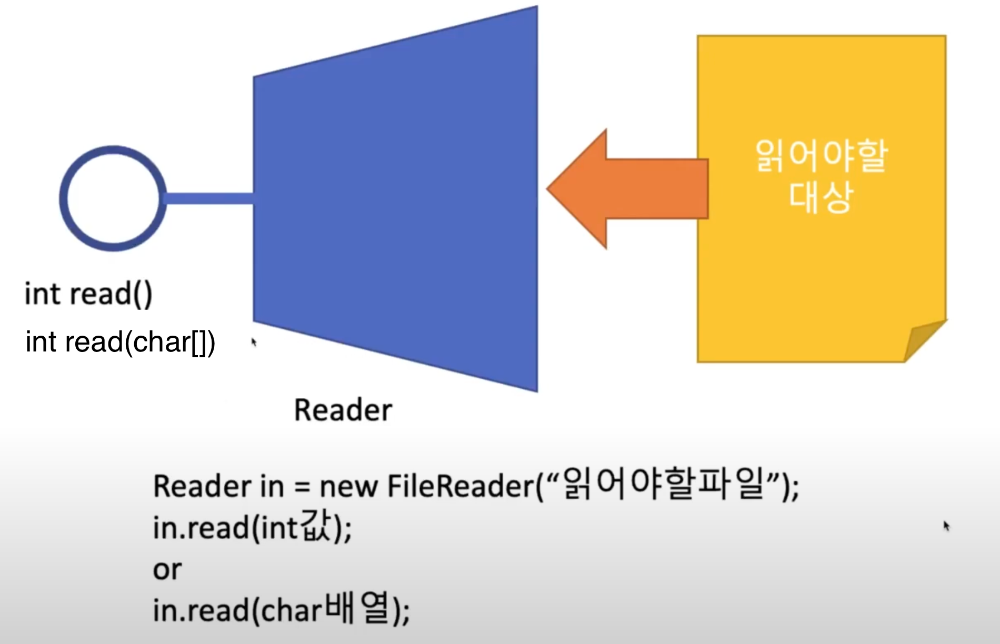
* Reader는 추상클래스이기 떄문에 new 연산자로 인스턴스를 생성할 수 없음!
* Reader를 이용하게 되면 읽어들여야 할 대상으로부터 읽어들임. (생성자에 들어온 값)
* Reader는 문자단위(char)로 읽어들임. 1개의 문자는 2byte를 차지함.
* `read()` 메소드를 사용하게 되면 정수값 중 맨 끝에 2byte에 값을 채워서 읽어들이게 됨
* 10byte 짜리 파일을 읽어들이려면 `read()` 메소드를 5번 호출해야 함.

---

### writer 정리
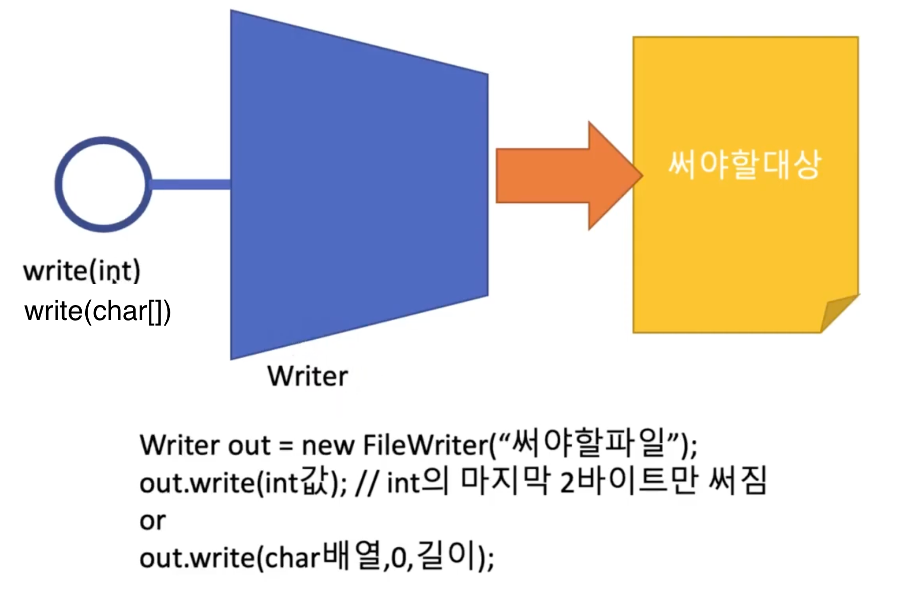
* Writer는 추상클래스이기 떄문에 new 연산자로 인스턴스를 생성할 수 없음!
* writer를 이용하게 되면 써야 할 대상으로부터 써줌. (생성자에 들어온 값)
* `write(int)` → write에 int 값을 넣어주게 되면 정수의 끝에 있는 2byte를 써야 할 대상에 써줌

--- 

### 예제 1 (Writer)
```java
import java.io.FileWriter;
import java.io.Writer;

public class HelloIO03 {
    public static void main(String[] args) throws Exception {
        Writer out = new FileWriter("/tmp/hello1.txt");
        out.write((int)'a'); // 문자 a를 정수로 형 변환하여 저장
        out.write((int)'h'); // 문자 h를 정수로 형 변환하여 저장
        out.write((int)'!'); // 문자 !를 정수로 형 변환하여 저장
        out.close();
    }
}
```
실행해보면 3byte짜리 파일이 저장이 된다.
```java
import java.io.FileWriter;
import java.io.Writer;

public class HelloIO03 {
    public static void main(String[] args) throws Exception {
        Writer out = new FileWriter("/tmp/hello2.txt");
        out.write((int)'가'); // 문자 가를 정수로 형 변환하여 저장
        out.write((int)'나'); // 문자 나를 정수로 형 변환하여 저장
        out.write((int)'다'); // 문자 다를 정수로 형 변환하여 저장
        out.close();
    }
}
```
실행해보면 9byte짜리 파일이 저장이 된다. (한글 유니코드 3바이트씩 저장)

---

### 예제 2 (Reader)
```java
import java.io.FileReader;
import java .io.Reader;

public class HelloIO04 {
    public static void main(String[] args) {
        Reader in = new FileReader("/tmp/hello2.txt");
        int ch1 = in.read(); // 정수를 리턴
        System.out.println((char)ch1); // 가 (정수로 형 변환하여 출력)
        int ch2 = in.read(); // 정수를 리턴
        System.out.println((char)ch2); // 나 (정수로 형 변환하여 출력)
        int ch3 = in.read(); // 정수를 리턴
        System.out.println((char)ch3); // 다 (정수로 형 변환하여 출력)
        int ch4 = in.read();
        System.out.println(ch4); // -1 (더 이상 읽어들일 것이 없음)
        in.close();
    }
}
```
실행 결과
```text
가
나
다
-1
```

### 예제 2 (Reader 개선) 
파일을 끝을 만날 때까지 반복해서 출력하게 되면 위처럼 일일히 read() 메소드를 사용할 필요가 없음
```java
import java.io.FileReader;
import java .io.Reader;

public class HelloIO04 {
    public static void main(String[] args) {
        Reader in = new FileReader("/tmp/hello2.txt");
        
        int ch = -1;
        
        // 읽어들인 것을 정수에 넣어준 뒤, -1이 아닐 떄까지 반복해라
        while ((ch = in.read()) != -1) {
            System.out.println((char)ch); // 정수로 읽어들였는데 실제론 문자이므로 문자로 형 변환하여 출력
        }
        
        in.close();
    }
}
```
실행 결과
```text
가
나
다
-1
```

---

### 연결해서 다양하게 쓰이는 Java IO

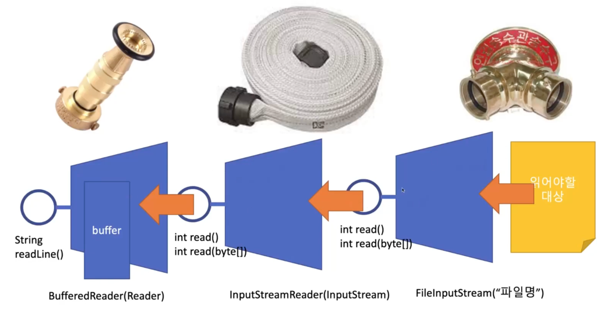

* 읽어들여야 할 대상이 File이다 → `FileInputStream`의 `read()` 메소드를 사용하여 읽어들임.
* `IO` 클래스 중 `InputStreamReader(InputStream)`는 `InputStream`을 통해 읽어들이겠다는 뜻 → `InputStreamReader`는 문자를 리턴해주는 `read()` 메소드를 갖고 있음
  * 즉, `InputStreamReader`의 `read()` 메소드를 사용하게 되면 `InputStream`의 `read()` 메소드를 내부적으로 사용하게 됨
  * `InputStreamReader`의 `read()` 메소드를 1번 호출하게 되면, 안에 들어온 `InputStream`의 `read()` 메소드를 2번 호출하게 됨 (문자(2byte)를 리턴하기 때문에)
* `BufferedEReader(Reader)`는 내부적으로 buffer를 갖고 있음. `readLine()` 한 줄을 읽어오는 메소드를 갖고 있음. 생성자에 Reader를 받아들임.
  * `readLine()` 메소드를 호출하게 되면 내부적으로 생성자 안에 들어온 `Reader`의 `read()` 메소드를 호출하게 됨 (한 줄이 채워질 때까지 호출하고 채워지면 문자열로 리턴)

✅ `BufferedReader(Reader)`의 `readLine()` 메소드를 호출하게 되면 ❓</br>
→ `Reader`, `InputStreamReader`, `InputStream`, `FileInputStream`의 메소드를 연결해서 계속 호출한다 ❗️❗️

### 예제 1 (PrintWriter)
```java
import java.io.FileOutputStream;
import java.io.OutputStreamWriter;
import java.io.PrintWriter;

public class HelloIO05 {
    public static void main(String[] args) {
        // FileOutputStream은 "/tmp/my.txt"에 저장한다.
        // FileOutputStream은 write(int); 메소드를 갖음 → int의 마지막 byte만 저장
        // OutputStreamWriter 생성자에 들어온 OutputStream의 write() 메소드를 이용하여 쓴다.
        // OutputStreamWriter는 write(int); 메소드를 갖음 → int의 끝 부분 char를 저장 
        // PrintWriter는 생성자에 들어온 OutputStreamWriter의 write() 메소드를 이요하여 쓴다.
        // PrintWriter는 println(문자열); → 문자열을 출력한다.
        PrintWriter out = new PrintWriter(new OutputStreamWriter(new FileOutputStream("/tmp/my.txt"));
        
        out.println("hello");
        out.println("world");
        out.println("!!!!");
        out.close();
    }
}
```
실행 결과 17byte의 다음과 같은 파일이 저장됨
```text
hello
world
!!!!
```

### 예제 2 (BufferedReader)
```java
import java.io.BufferedReader;
import java.io.FileInputStream;
import java.io.InputStream;

public class HelloIO06 {
    public static void main(String[] args) {
        BufferedReader in = new BufferedReader(new InputStreamReader(new FileInputStream("/tmp/my.txt")));
        
        String line1 = in.readLine(); // hello
        String line2 = in.readLine(); // world
        String line3 = in.readLine(); // !!!!
        String line4 = in.readLine(); // null (더 이상 읽어들일게 없음)

        System.out.println(line1);
        System.out.println(line2);
        System.out.println(line3);
        System.out.println(line4);
        
        in.close();
    }
}
```
실행 결과
```text
hello
world
!!!!
null 
```

### 예제 2 (BufferedReader 개선)
10000줄이 있다면 readLine() 메소드를 10000번이나 호출해야 하는 번거로움이 있음 
```java
import java.io.BufferedReader;
import java.io.FileInputStream;
import java.io.InputStream;

public class HelloIO06 {
    public static void main(String[] args) {
        BufferedReader in = new BufferedReader(new InputStreamReader(new FileInputStream("/tmp/my.txt")));
        
        String line = null;
        
        // 한 줄 읽어들인 것을 line에 넣어줌. 이 과정을 null이 아닐 때까지 반복
        while ((line = in.readLine()) != null){
            System.out.println(line);
        }
        in.close();
    }
}
```
실행 결과
```text
hello
world
!!!!
```

---

### Composite 패턴

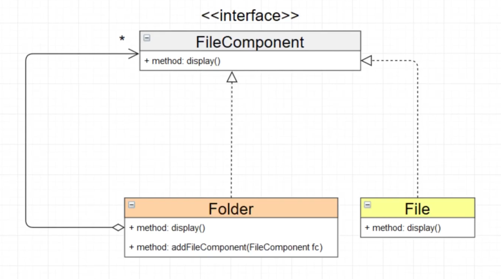

* 위의 그림에서는 interface로 예시가 나와있는데 추상클래스도 가능하다.
* Folder와 File은 모두 FileComponent를 상속받고 있음 
* Folder는 FileComponent를 가질 수 있다는 뜻 
  * = FileComponent를 상속받거나 구현하고 있는 Folder나 File들을 가질 수 있다는 뜻

Java IO는 Decorator 패턴으로 되어있다.

Composite 패턴은?

### Composite 패턴 예시
1. Node 클래스
```java
public abstract class Node {
    // 필드
    private String name;
    
    // 생성자
    public Node(String name) {
      this.name = name;
    }
    
    // getter
    public String getName() {
      return name;
    }
    
    // setter
    public void setName(String name) {
        this.name = name;
    }
    
    // 추상 메소드
    public abstract long getSize();
    
    public abstract boolean isFolder();
}
```
2. File 클래스
```java
public class File extends Node {
    private long size;
    
    // super(Node)에 name을 전달해서 초기화, 자신의 필드 size를 파라미터로 들어온 size로 바꿔주는 생성 
    public File(String name, long size){
        super(name);
        this.size = size;
    }
    
    // 추상 메소드 오버라이드, 자신의 size값을 리턴
    @Override
    public long getSize() {
        return this.size;
    }
    
    // 추상 메소드 오버라이드, File은 폴더가 아니기 때문에 false를 리턴하는 메소드
    @Override
    public boolean isFolder() {
        return false;
    }
}
```
3. Folder 클래스
```java
import java.util.ArrayList;
import java.util.List;

public class Folder extends Node {
    // Folder는 Node를 여려 개 가진다는 의미의 필드 선언
    private List<Node> nodes;
    
    // super(Node)에 name을 전달해서 초기화, nodes는 현재 참조하는 것이 없는 null이므로 new ArrayList()로 초기화
    public Folder(String name) {
        super(name);
        nodes = new ArrayList<>();
    }
    
    // 메소드 오버로딩
    // File을 받아들여 nodes에 add (Node의 자식들을 모두 가질 수 있음)
    public void add(File file) {
        nodes.add(file);
    }

    // Folder를 받아들여 nodes에 add (Node의 자식들을 모두 가질 수 있음)
    public void add(Folder folder) {
        nodes.add(folder);
    }
    
    // nodes의 size만큼 반복하여 size를 구하는 메소드
    @Override
    public long getSize() {
        long total = 0L;
        for (int i = 0; i < nodes.size(); i++){
            total = total + nodes.get(i).getSize();
        }
        return total;
    }
}
```
4. CompositePatternDemo 클래스
```java
public class CompositePatternDemo {
    File f1 = new File("file1, 10L");
    File f2 = new File("file2, 20L");
    File f3 = new File("file3, 30L");
    
    Folder folder1 = new Folder("folder1");
    Folder folder2 = new Folder("folder2");
    
    // Folder는 File도 가질 수 있고 Folder도 가질 수 있음
    folder1.add(f1);
    folder2.add(folder2); // f2, f3값이 들어있음
    
    // File만 추가
    folder2.add(f2);
    folder2.add(f3);
    
    System.out.println(folder1.getSize());
}
```
출력 결과
```text
60
```

***Folder와 File을 Node라는 부모클래스(공통적인 것)를 둠으로써 일체화시키는 패턴이 composite 패턴이다!!!***


---

### Decorator 패턴

* Composite 패턴과 거의 비슷함
* Component와 Component를 상속받고 있는 ConcreteComponent 객체, Decorator 객체가 있음. (보통 대부분 추상 클래스)
* 그리고 Decorator를 상속받고 있는 또 다른 객체가 있을 수 있음.
* Decorator는 Component를 가질 수 있으며, 이는 Component를 상속받고 모든 있는 것들을 가질 수 있다는 의미

### Decorator 패턴 예시
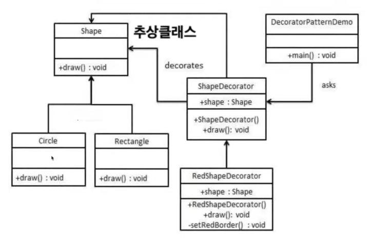
* Shape와 Shape를 상속받고 있는 Circle, Rectangle 클래스가 있음.
* Circle, Rectangle을 장식할 수 있는 ShapeDecorator, RedShapeDecorator 클래스가 있음.
* ShapeDecorator는 장식할 대상을 갖고 있어야하기 때문에 Shape 클래스를 가지는 관계로 표현되어 있음.


1. Shape 클래스 
```java
public abstract class Shape {
    // 추상 메소드
    public abstract void draw();
}
```
2. Circle 클래스
```java
public class Circle extends Shape {
    // 메소드 오버라이딩
    @Override
    public void draw() {
        System.out.println("shape : Circle");
    }
}
```
3. Rectangle 클래스
```java
public class Rectangle extends Shape {
    // 메소드 오버라이딩
    @Override
    public void draw() {
        System.out.println("shape : Rectangle");
    }
}
```
4. ShapeDecorator 클래스
```java
public abstract class ShapeDecorator extends Shape {
    // Shape 타입의 필드 선언 (Shape를 상속받고 있는 모든 것들을 가질 수 있음)
    protected Shape decoratedShape;
    
    // 생성자에서 내가 장식할 대상(Shape)을 받아들여서 필드로 초기화
    public ShapeDecorator(Shape decoratedShape) {
        this.decoratedShape = decoratedShape;
    }
    
    // 내가 장식할 대상(Shape) decoratedShape가 갖고 있는 draw() 메소드 호출
    public void draw() {
        decoratedShape.draw();
    }
}
```
5. RedShapeDecorator 클래스
```java
public class RedShapeDecorator extends ShapeDecorator {
    // 생성자에서 내가 장식할 대상(Shape)을 받아들여서 super(ShapeDecorator)에 넘겨줌
    public RedShapeDecorator(Shape decoratedShape) {
        super(decoratedShape);
    }
    
    // RedShapeDecorator가 호출되면 draw() 메소드 호출
    @Override
    public void draw() {
        setRedBorder(decoratedShape);
    }
    
    private void setRedBorder(Shape decoratedShape){
        System.out.println("Red ================== Start");
        decoratedShape.draw();
        System.out.println("Red ================== End");
    }
}
```
6. GreenShapeDecorator 클래스
```java
public class GreenShapeDecorator extends ShapeDecorator {
    // 생성자에서 내가 장식할 대상(Shape)을 받아들여서 super(ShapeDecorator)에 넘겨줌
    public GreenShapeDecorator(Shape decoratedShape) {
        super(decoratedShape);
    }
    
    // GreenShapeDecorator가 호출되면 draw() 메소드 호출
    @Override
    public void draw() {
        setRedBorder(decoratedShape);
    }
    
    private void setRedBorder(Shape decoratedShape){
        System.out.println("Green ================== Start");
        decoratedShape.draw();
        System.out.println("Green ================== End");
    }
}
```
7. DecoratorPatternDemo1 클래스
```java
public class DecoratorPatternDemo1 {
    public static void main(String[] args) {
        Circle circle = new Circle();
        
        circle.draw();
    }
}
```
```text
shape : Circle
```
8. DecoratorPatternDemo2 클래스 (circle을 빨갛게 칠하고 싶을 떼)
```java
public class DecoratorPatternDemo2 {
    public static void main(String[] args) {
        Circle circle = new Circle();
        
        RedShapeDecorator redShapeDecorator = new RedShapeDecorator(circle);
        redShapeDecorator.draw();
        
    }
}
```
```text
Red ================== Start
shape : Circle
Red ================== End
```
9. DecoratorPatternDemo3 클래스 (빨갛게 칠해진 circle을 초록색으로 칠하고 싶을 때)
```java
public class DecoratorPatternDemo3 {
    public static void main(String[] args) {
        Circle circle = new Circle();
        
        RedShapeDecorator redShapeDecorator = new RedShapeDecorator(circle);

        GreenShapeDecorator greenShapeDecorator = new GreenShapeDecorator(redShapeDecorator);
        greenShapeDecorator.draw();
        
    }
}
```
```text
Green ================== Start
Red ================== Start
shape : Circle
Red ================== End
Green ================== End
```
10. DecoratorPatternDemo4 클래스 (빨갛게 칠해진 rectangle을 초록색으로 칠하고 싶을 때)
```java
public class DecoratorPatternDemo3 {
    public static void main(String[] args) {
        
        Shape shape = new GreenShapeDecorator(new RedShapeDecorator(new Rectangle()));
        shape.draw();
        
        // Shape ==> InputStream (추상클래스)
        // Rectangle
//        InputStream in = new DataInputStream(new FileInputStream("a.txt"));
    }
}
```
```text
Green ================== Start
Red ================== Start
shape : Rectangle
Red ================== End
Green ================== End
```

Java IO도 위와 똑같음
```java
public class JavaIODemo {
    public static void main(String[] args) throws Exception{
        
//        Shape shape = new GreenShapeDecorator(new RedShapeDecorator(new Rectangle()));
//        shape.draw();
        
        // Shape ==> InputStream (추상클래스)
        // Rectangle ==> FileInputStream
        // RedShapeDecorator ==> DataInputStream
        InputStream in = new DataInputStream(new FileInputStream("a.txt"));
    }
}
```

***InputStream (추상클래스)이 Shape 역힐을 수행하고</br>
FileInputStream이 Rectangle의 역할</br>
DataInputStream이 RedShapeDecorator 역할을 수행하는 것과 같음!!!***

### 결론
**✅ Java IO를 잘 알기 위해서는 주인공과 장식을 구분할 수 있어야 한다! → Java IO는 Decorator 패턴으로 이루어져 있기 때문❗️**

---

### DataInputStream, DataOutputStream
* 기본형 타입과 문자열을 읽고 쓸 수 있다.
* DataOutputStream는 다양한 타입을 저장할 때 사용

### 예제 1 (DataOutputStream)
```java
public class IOExam11 {
    public static void main(String[] args) {
        // 문제 : 이름, 국어, 영어, 수학, 총점, 평균 점수를 /tmp/score.dat 파일에 저장하시오.
        String name = "kim";
        int kor = 90;
        int eng = 50;
        int math = 70;
        double total = kor + eng + math;
        double avg = total / 3.0;
        
        // 다양한 타입을 저장할 때 사용하는 객체가 DataOutputStream
        // DataOutputStream은 파라미터로 OutputStream을 받아들임 → 장식 역할
        DataOutputStream out = new DataOutputStream(new FileOutputStream("/tmp/score.dat"));
        // writeUTF()는 이름을 저장하는 메소드
        out.writeUTF(name);
        // writeInt()은 정수값을 저장하는 메소드
        out.writeInt(kor);
        out.writeInt(eng);
        out.writeInt(math);
        // writeInt()은 실수값을 저장하는 메소드
        out.writeDouble(total);
        out.writeDouble(avg);
        
        out.close();
    }
}
```
```text
ls -la /tmp/score,dat
```
터미널에서 다음 명령을 실행해보면 파일이 하나 만들어진 것을 볼 수 있다.

### 예제 2 (DataInputStream)
```java
public class IOExam12 {
    public static void main(String[] args) {
        // 문제 : 이름, 국어, 영어, 수학, 총점, 평균 점수를 /tmp/score.dat 파일에서 읽어들이시오.
      
        DataInputStream in = new DataInputStream(new FileInputStream("/tmp/score.dat"));
        // 쓴 순서와 똑같이 읽어들여야 함❗️
        String name = in.readUTF();
        int kor = in.readInt();
        int eng = in.readInt();
        int math = in.readInt();
        
        double total = in.readDouble();
        double avg = in.readDouble();
        in.close();

        System.out.println(name);
        System.out.println(kor);
        System.out.println(eng);
        System.out.println(math);
        System.out.println(total);
        System.out.println(avg);
    }
}
```
실행 결과
```text
kim
90
50
70
210.0
70.0
```

---

### ByteInputStream, ByteOutputStream
* byte[]에 데이터를 읽고 쓰기

### 예제 1 (ByteArrayOutputStream)
```java
public class IOExam13 {
    public static void main(String[] args) throws Exception {
        int data1 = 1;
        int data2 = 2;
        // ByteArrayOutputStream은 내부적으로 메모리를 갖고 있다.
        ByteArrayOutputStream out = new ByteArrayOutputStream();
        out.write(data1); // data1의 마지막 1byte만 저장한다.
        out.write(data2); // data2의 마지막 1byte만 저장한다.
        out.close();
        
        // toByteArray() 메소드는 out에 저장한 Byte 배열 값을 읽어온다.
        byte[] array = out.toByteArray();
        System.out.println(array.length);
        System.out.println(array[0]);
        System.out.println(array[1]);
    }
}
```
```text
2
1
2
```

### 예제 2 (ByteArrayInputStream)
```java
public class IOExam14 {
    public static void main(String[] args) throws Exception {
        // ByteArrayInputStream는 byte 배열로부터 읽어들이는 것이기 때문에 byte 배열 선언해줘야 함.
        byte[] array = new byte[2];
        // 정수 1을 byte로 변환하여 배열에 넣음
        array[0] = (byte) 1; 
        array[1] = (byte) 2; 
        ByteArrayInputStream in = new ByteArrayInputStream(array);\
        int read1 = in.read(); // 1 (1byte 값을 읽어들여서 리턴)
        int read2 = in.read(); // 2 (1byte 값을 읽어들여서 리턴)
        int read3 = in.read(); // -1 (더 이상 읽어들일게 없으므로)

        System.out.println(read1);
        System.out.println(read2);
        System.out.println(read3);
    }
}
```
```text
1
2
-1
```

---

### CharArrayReader, CharArrayWriter
* char[]에 데이터를 읽고 쓰기

---

### StringReader, StringWriter
* 문자열 읽고 쓰기

### 예제 1 (StringWriter)
```java
public class IOExam15 {
    public static void main(String[] args) {
        // StringWriter는 생성자에 아무것도 받아들이지 않음 → 메모리에 쓴다고 생각하면 됨
        StringWriter out = new StringWriter();
        out.write("hello");
        out.write("world");
        out.write("!!!");
        out.close();
        
        String str = out.toSting();
        System.out.println(str);
    }
}
```
```text
helloworld!!!
```
전체가 합쳐진 문자열로 출력이 되는 것을 볼 수 있음!

### 예제 2 (StringReader)

```java
public class IOExam16 {
    public static void main(String[] args) {
        // StringReader는 파라미터로 문자열이 들어옴
        StringReader in = new StringReader("helloworld!!!");
        int ch = -1;
        
        // 문자 하나를 읽어들여 ch에 저장한 뒤, 더 이상 읽어들일 것이 없을 때까지(-1이 아닐 때까지) 반복
        while ((ch = in.read()) != -1) {
            System.out.print((char)ch); // ch는 정수값이기 때문에 형 변환
        }
        
        in.close();
    }
}
```
```text
helloworld!!!
```

---

### ObjectInputStream, ObjectOutputStream
* 직렬화 가능한 대상을 읽고 쓸 수 있다.
* 직렬화 가능한 대상은 기본형 타입 또는 java.io.Serializable 인터페이스를 구현하고 있는 객체이다.
* java.io.Serializable는 메소드를 갖고 있지 않기 때문에 인터페이스만 구현해주면 됨 (메소드 구현 필요 x)
* 메소드를 갖고 있지 않는 인터페이스를 마커 인터페이스(marker interface)라고 함

### 예제 1 (ObjectOutputStream)
1. User 클래스
```java
public class User implements Serializable {
    // String과 int 를 들어가보면 Serializable을 구현하고 있는걸 알 수 있다. → 직렬화가 가능하다❗️
    private String email;
    private String name;
    private int birthYear;
    
    // 생성자
    public User(String email, String name, int birthYear) {
      this.email = email;
      this.name = name;
      this.birthYear = birthYear;
    }
    
    // getter
    public String getEmail() {
      return email;
    }
  
    public String getName() {
      return name;
    }
  
    public int getBirthYear() {
      return birthYear;
    }
    
    // toString 메소드
    @Override
    public String toString() {
        return "User{" +
                "email='" + email + '\'' +
                ", name='" + name + '\'' +
                ", birthYear=" + birthYear +
                '}';
                
    }
}
```
2. ObjectOutputExam 클래스
```java
public class ObjectOutputExam {
    public static void main(String[] args) throws Exception {
        User user =  new User("hong@example.com", 홍길동, 1992);
        
        // /tmp/user.dat에 저장
        ObjectOutputStream out = new ObjectOutputStream(new FileOutputStream("/tmp/user.dat"));
        
        // user를 객체직렬화 시켜 파일에 저장
        out.writeObject(user);
        out.close();
    }
}
```
```text
ls -la /tmp/user.dat
```
터미널에서 다음 명령을 실행시켜보면 파일 하나가 생성된 것을 볼 수 있음. 

### 예제 2 (ObjectInputStream)
1. ObjectInputExam 클래스
```java
public class ObjectInputExam {
    public static void main(String[] args) throws Exception {
        // FileInputStream을 통해서 ObjectInputStream을 읽어들임
        ObjectInputStream in = new ObjectInputStream(new FileInputStream("/tmp/user.dat"));
        
        // readObject() 메소드는 오브젝트 타입을 읽어들여 리턴함 → User 타입으로 저장했기 떄문에 User 타입으로 형 변환 필요
        User user = (User) in.readObject();
        in.close();
        System.out.println(user);
    }
}
```
2. 출력 결과
```text
User{email='hong@example.com', name='홍길동', birthYear=1992}
```
`readObject()` 메소드가 파일로부터 인스턴스 정보를 읽어들여서 인스턴스를 만들어내고, 그것을 user에 담아 출력을 해줌 → **직렬화**

### 예제 3 (ObjectOutputStream)
1. ObjectOutputExam2 클래스 (여러 명의 유저를 저장)
```java
public class ObjectOutputExam2 {
    public static void main(String[] args) throws Exception {
        User user1 =  new User("hong@example.com", 홍길동, 1992);
        User user2 =  new User("go@example.com", 고길동, 1995);
        User user3 =  new User("d@example.com", 둘리, 1991);
        
        // ArrayList도 들어가보면 Serializable을 구현하고 있음 → 직렬화 가능❗️
        ArrayList<User> list = new ArrayList<>();
        list.add(user1);
        list.add(user2);
        list.add(user3);
        
        // /tmp/userlist.dat에 저장
        ObjectOutputStream out = new ObjectOutputStream(new FileOutputStream("/tmp/userlist.dat"));
        
        // list를 객체직렬화 시켜 파일에 저장 (list 안에 있는 user들까지 함께 저장이 됨)
        out.writeObject(list);
        out.close();
    }
}
```
```text
ls -la /tmp/userlist.dat
```
터미널에서 다음 명령을 실행시켜보면 파일 하나가 생성된 것을 볼 수 있음.

### 예제 4 (ObjectInputStream)
1. ObjectInputExam2 클래스
```java
public class ObjectInputExam2 {
    public static void main(String[] args) throws Exception {
        // FileInputStream을 통해서 ObjectInputStream을 읽어들임
        ObjectInputStream in = new ObjectInputStream(new FileInputStream("/tmp/userlist.dat"));
        
        // readObject() 메소드는 오브젝트 타입을 읽어들여 리턴함 → Arraylist 타입으로 저장했기 떄문에 Arraylist 타입으로 형 변환 필요
        Arraylist<User> list = (Arraylist) in.readObject();
        in.close();
        
        // list에 들어가 있는 데이터 길이만큼 반복하면서 list에 있는 원소들을 출력
        for (int i = 0; i < list.size(); i++) {
          System.out.println(list.get(i));
        }
      
    }
}
```
2. 출력 결과
```text
User{email='hong@example.com', name='홍길동', birthYear=1992}
User{email='go@example.com', name='고길동', birthYear=1995}
User{email='d@example.com', name='둘리', birthYear=1991}
```
파일로부터 직렬화 되어있는 list 정보를 역직렬화하여 읽어들인 뒤, list의 size만큼 반복하여 출력해주고 있음!! → **직렬화**

### 예제 5
1. InputOutputExam 클래스 (ver1)
```java
public class InputOutputExam {
    public static void main(String[] args) {
        User user1 =  new User("hong@example.com", 홍길동, 1992);
        User user2 =  new User("go@example.com", 고길동, 1995);
        User user3 =  new User("d@example.com", 둘리, 1991);
  
        // ArrayList도 들어가보면 Serializable을 구현하고 있음 → 직렬화 가능❗️
        ArrayList<User> list = new ArrayList<>();
        list.add(user1);
        list.add(user2);
        list.add(user3);
        
        // 위에서 만든 ArrayList 인스턴스를 참조하고 있는 list를 list2도 참조하라는 뜻 (= 같은 ArrayList를 참조하라는 뜻)
        ArrayList<User> list2 = list;
        
        for (int i = 0; i < list2.size(); i++) {
            System.out.println(list2.get(i));
        }
    }
}
```
2. 출력 결과
```text
User{email='hong@example.com', name='홍길동', birthYear=1992}
User{email='go@example.com', name='고길동', birthYear=1995}
User{email='d@example.com', name='둘리', birthYear=1991}
```
위에서 만든 ArrayList 인스턴스를 참조하고 있는 list를 list2도 참조하라는 뜻  (= 같은 ArrayList를 참조하라는 뜻)</br>
ArrayList 전체를 복사하라는 뜻이 아님 🚫

✅ 이 말은 list가 참조하고 있는 것 중에 하나(user3)를 지워버린다면 list2도 지워질 것임❗️
1. ObjectInputExam2 클래스 (ver2)
```java
public class InputOutputExam {
    public static void main(String[] args) {
        User user1 =  new User("hong@example.com", 홍길동, 1992);
        User user2 =  new User("go@example.com", 고길동, 1995);
        User user3 =  new User("d@example.com", 둘리, 1991);
  
        // ArrayList도 들어가보면 Serializable을 구현하고 있음 → 직렬화 가능❗️
        ArrayList<User> list = new ArrayList<>();
        list.add(user1);
        list.add(user2);
        list.add(user3);
        
        // 위에서 만든 ArrayList 인스턴스를 참조하고 있는 list를 list2도 참조하라는 뜻 (= 같은 ArrayList를 참조하라는 뜻)
        ArrayList<User> list2 = list;
        
        for (int i = 0; i < list2.size(); i++) {
            System.out.println(list2.get(i));
        }
        
        // 2번째 index 값을 지움
        list.remove(2);
        System.out.println(list.size());
        System.out.println(list2.size());
    }
}
```
2. 출력 결과
```text
User{email='hong@example.com', name='홍길동', birthYear=1992}
User{email='go@example.com', name='고길동', birthYear=1995}
User{email='d@example.com', name='둘리', birthYear=1991}
2
2
```
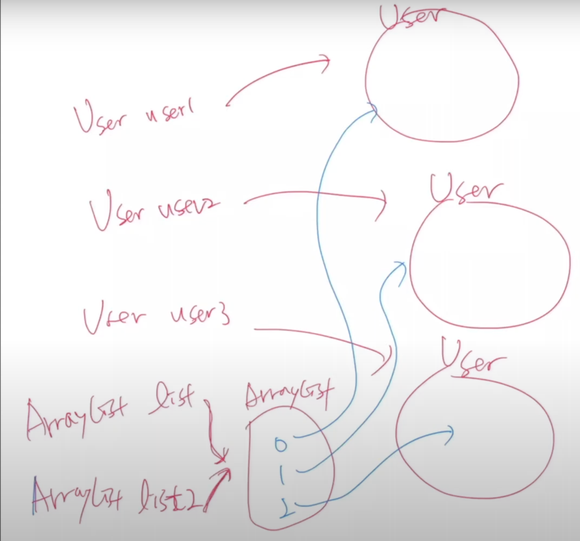
같은 ArrayList를 참조하고 있기 때문에 size값이 동일한 것을 알 수 있음!

1. ObjectInputExam2 클래스 (ver3)
```java
public class InputOutputExam {
    public static void main(String[] args) {
        User user1 =  new User("hong@example.com", 홍길동, 1992);
        User user2 =  new User("go@example.com", 고길동, 1995);
        User user3 =  new User("d@example.com", 둘리, 1991);
  
        // ArrayList도 들어가보면 Serializable을 구현하고 있음 → 직렬화 가능❗️
        ArrayList<User> list = new ArrayList<>();
        list.add(user1);
        list.add(user2);
        list.add(user3);
        
        // ArrayList 객체를 하나 더 생성 
        ArrayList<User> list2 = new ArrayList<>();
        
        // list의 size만큼 반복하여 list2에 list의 i번째 것을 꺼내서 담음
        for (int i = 0; i < list2.size(); i++) {
            list2.add(list.get(i));
        }
        
        // 2번째 index 값을 지움
        list.remove(2);
        System.out.println(list.size());
        System.out.println(list2.size());
    }
}
```

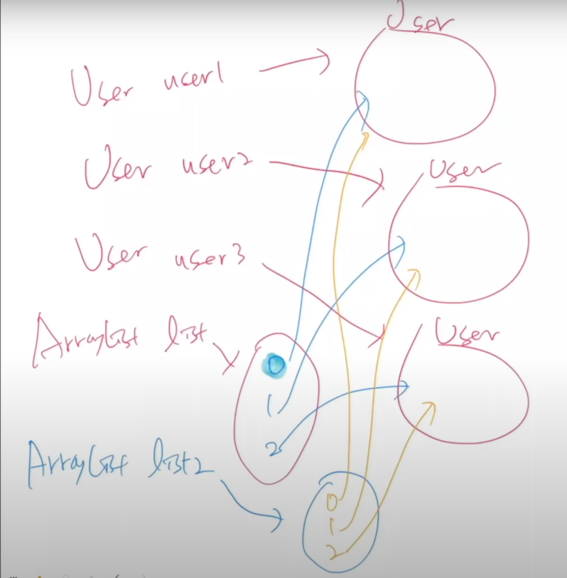

ArrayList 자체는 별도로 따로 생겼지만 같은 User를 참조하고 있기 때문에 User의 정보를 변경하게 되면 list와 list2의 정보가 바뀌게 된다.

→ ***즉, ArrayList만 새로 더 만들었을 뿐이지 User 자체는 복사가 되지 않는다.*** 이것을 알고리즘에선 **얕은 복사(Shallow Copy)** 라고 함 ❗️

### 얕은 복사 (Shallow Copy)
* 얕은 복사란 객체를 복사할 때 기존 값과 복사된 값이 같은 참조를 가리키고 있는 것을 말한다. 
* 객체 안에 객체가 있을 경우 한 개의 객체라도 기존 변수의 객체를 참조하고 있다면 이를 얕은 복사라고 한다.

✅ User 자체를 복사하고 싶을 때는 객체직렬화가 필요하다
1. ObjectInputExam2 클래스 (ver4)
```java
public class InputOutputExam {
    public static void main(String[] args) {
        User user1 =  new User("hong@example.com", 홍길동, 1992);
        User user2 =  new User("go@example.com", 고길동, 1995);
        User user3 =  new User("d@example.com", 둘리, 1991);
  
        // ArrayList도 들어가보면 Serializable을 구현하고 있음 → 직렬화 가능❗️
        ArrayList<User> list = new ArrayList<>();
        list.add(user1);
        list.add(user2);
        list.add(user3);
        
        // ObjectOutputStream을 쓴 것이 byte 배열에 저장
        ByteArrayOutputStream bout = new ByteArrayOutputStream();
        ObjectOutputStream out = new ObjectOutputStream(bout);
        
        // list와 함께 list에 포함된 User까지 직렬화
        out.WriteObject(list);
        
        // 선언한 것의 반대로 close
        out.close();
        bout.close();
        
        // list 자체가 직렬화가 되여 byte 배열이 됨
        byte[] array = bout.toByteArray();
        
        // 직렬화 된 것을 ObjectInputStream을 통해 읽어들임
        ObjectInputStream in = new ObjectInputStream(new ByteArrayInputStream(array));
        
        // ArrayList로 형 변환하여 읽어들임
        ArrayList<User> list2 = (ArrayList) in.readObject();
        in.close();
        
        // list에서 2번째 index값을 지움
        list.remove(2);

      // list2의 size만큼 반복하여 list2의 i번째를 담아서 출력
        for (int i = 0; i < list2.size(); i++) {
            System.out.println(list2.get(i));
        }
    }
}
```
2. 출력 결과
```text
User{email='hong@example.com', name='홍길동', birthYear=1992}
User{email='go@example.com', name='고길동', birthYear=1995}
User{email='d@example.com', name='둘리', birthYear=1991}
```

>**Reference**
><br/>부부개다 - 즐겁게 프로그래밍 배우기.