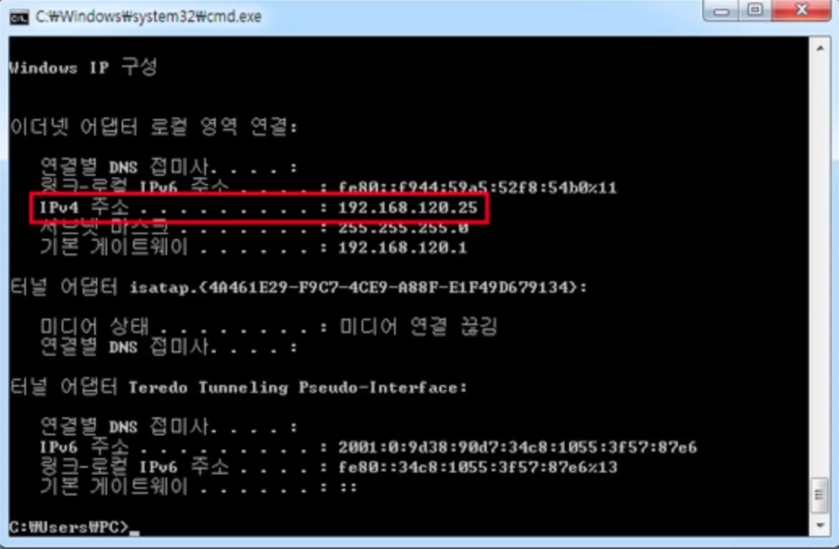
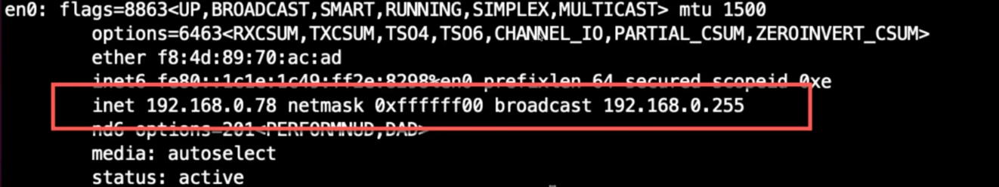
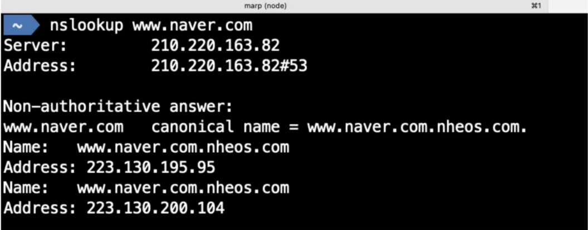
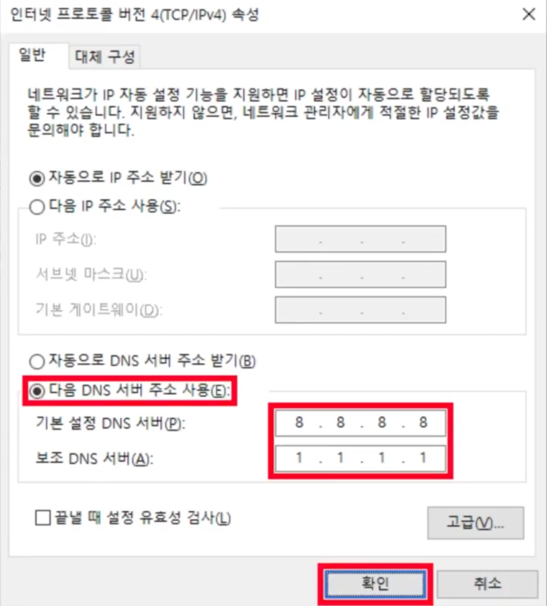
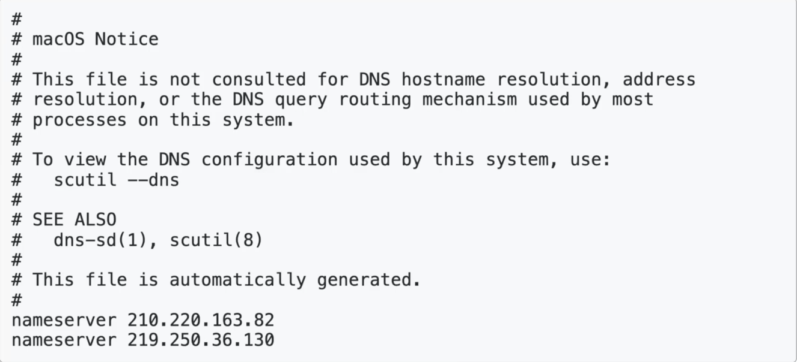
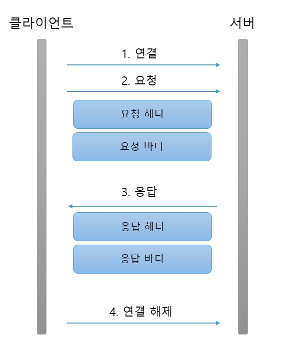

## 네트워크 프로그래밍

---
### IP 주소와 Port

* 컴퓨터를 구분하는 주소 : IP
* 컴퓨터 안에 있는 서버들을 구분하는 값 : Port

하나의 컴퓨터에는 여러 개의 서버가 실행될 수 있는데, 서버 프로그램들이 사용하는 구분값을 Port라고 한다.</br>
Port는 정수값이며, 같은 포트로 서버 여러 개가 함께 동작할 수 없음. → 서버 하나 당 Port 값은 다 다르게 동작해야 한다.

* 윈도우 사용자 : ipconfig 명령어 사용



* Mac 사용자 : ifconfig 명령어 사용



| 구분                         | 범위            | 설명                                        |
|----------------------------|---------------|-------------------------------------------|
| Well Known Port 번호         | 0 ~ 1023      | 국제 인터넷 주소 관리 기구(ICANN)에서 미리 예약해둔 포트       |
| Registered Port 번호         | 1024 ~ 49151  | 개인 또는 회사에서 사용하는 포트                        |
| Dynamic 또는 Private Port 번호 | 49152 ~ 65535 | 운영체제가 부여하는 동적 포트 또는 개인적인 목적으로 사용할 수 있는 포트 |

* 웹 서버는 기본이 80번 포트를 사용, FTP는 21번 포트를 사용
* 0 ~ 1023 안에 있는 포트들(Well Known Port)은 굉장히 중요한 서버, 많이 알려진 서버들이 사용하는 포트라고 생각하면 됨

---

### 127.0.0.1

* 컴퓨터 자신의 IP

---

### 도메인(Domain 주소)

>https://www.naver.com</br>
>https://www.daum.net</br>
>https://www.google.com

* https://www.naver.com, https://www.daum.net, https://www.google.com은 도메인 주소이다.

---

### 도메인 네임 서버 (Domain Name Server: DNS)

* 도메인 주소를 IP로 변환한다.
* nslookup 도메인 주소
  * 위의 명령으로 도메인에 해당하는 IP 주소를 알 수 있다. 



도메인 네임 서버가 설정이 되어 있지 않으면 주소를 적어도 IP를 찾을 수 없음.

---

### 윈도우에서 DNS 설정하기



### Mac, Linyx에서 DNS 설정하기

* /etc/resolv.conf 파일에서 설정한다.



네임서버도 서버이기 때문에 죽을 수도 있기 때문에, 서버가 죽었을 때 다음 서버가 실행될 수 있도록 보통 2개로 설정

---

### localhost

* 컴퓨터 자신의 도메인

---

### IP 주소 알아내기

* InetAddress 로 알아낸다.
* 사용자 컴퓨터의 IP 주소 알아내기
```text
InetAddress ia = InetAddress.getLocalHost();
System.out.println(ia.getHostAddress());
```
* google의 IP 주소 알아내기
```java
InetAddress[] isArr = InetAddress.getAllByName("www.google.com");
for(InetAddress ia : iaArr){
        System.out.println(ia.getHostAddress());
    }
```

### 예제 1
1. IpAddressExam01 클래스
```java
import java.net.InetAddress;

public class IpAddressExam01 {
    public static void main(String[] args) {
        try {
          InetAddress ia = InetAddress.getLocalHost(); // 내 컴퓨터의 IP 정보를 구한다. checkedException을 발생시키기 떄문에 반드시 Exception 처리를 해줘야 함
          System.out.println(ia.getHostAddress());
        }catch (UnKnownHostException uhe){
            uhe.printStackTrace();
        }
    }
}
```
출력 결과
```text
내 컴퓨터 IP 주소가 출력됨
```

### 예제 2

1. IpAddressExam02 클래스
```java
import java.net.InetAddress;
import java.net.UnknownHostException;

public class IpAddressExam02 {
    public static void main(String[] args) {
        try {
          InetAddress[] iaArray = InetAddress.getAllByName("www.google.com"); // 내 컴퓨터의 IP 정보를 구한다. checkedException을 발생시키기 떄문에 반드시 Exception 처리를 해줘야 함
            for(InetAddress ia : iaArray){ // 배열의 개수만큼 반복하며 출력
              System.out.println(ia.getHostAddress());
            }
        }catch (UnKnownHostException uhe){
            uhe.printStackTrace();
        }
    }
}
```
출력 결과
```text
142.251.220.36 (Inet4 형식)
2404:6800:4005:81c:0:0:0:2004 (Inet6 형식)
```
출력 결과 IP 주소가 2가지가 출력되는 것을 알 수 있다.
* 하나는 Inet4 주소이고 하나는 Inet6 주소이다. 
* IP가 고갈되고 있기 때문에 2가지 사용. 
  * 사람들이 사용하는 컴퓨터가 너무 많아 Inet4 형식으로는 모든 컴퓨터에게 할당해줄 수가 없음.
  * 그래서  Inet6 형식의 주소를 사용

---

### Client & Server 프로그래밍
* Socket : Server에 접속을 하는 역할
* ServerSocket : Client가 접속 요청을 기다리는 역할
  * Client 요청을 기다리다가 접속을 하면 Socket을 반환한다.
* Socket과 Socket 간에는 IO 객체를 이용하여 통신할 수 있다.

---

### HTTP 프로토콜 : 규약



1. **클라이언트가 원하는 서버에 접속 (접속)**
2. **클라이언트가 서버에 요청 (요청 정보)**
   * 요청은 정해진 규칙에 따름
   * 요청 메시지는 크게 헤더 부분, 빈 줄 부분, 요청 바디 부분으로 나누어짐
     * 헤더 부분에 첫번째 줄에는 요청 메서드(GET, POST, PUT…)와 자원의 위치인 요청 URI 그리고 HTTP 프로토콜 버전이 나온다.
     * 헤더의 두번째 줄부터는 여러 헤더 정보가 나온다.
     * 바디 부분에는 요청 메서드가 POST나 PUT일 때의 내용이 들어온다.

3. **서버는 클라이언트에게 응답을 보낸다. (응답 정보)**
   * 요청과 똑같은 3부분으로 나뉜다.
     * 헤더의 첫번째 줄에는 응답 HTTP의 프로토콜 버전, 응답코드, 응답 메시지가 있다.
     * 헤더의 나머지 부분에는 날짜, 웹 서버 이름과 버전 등의 정보가 나온다.
     * 바디 부분에 나오는 것이 실제 응답 리소스 데이터이다.

4. **클라이언트와 서버와의 연결이 끊어진다. (접속 Close)**

---

### Java에서 Client Server 프로그래밍

1. ServerSocket (Port값을 갖고 있음) 객체 생성
2. `accept()` 메소드를 사용하게 되면 Client를 기다림
   * 이 때, Client는 Socket 이라는 인스턴스를 만듦 (접속하기 위해선 IP와 Port가 필요)
   * Client는 `accept()` 메소드를 통해 접속하고 Server는 Socket을 리턴
   * Client와 Server는 모두 Socket이 생긴 상태 (서로가 연결되어 있는 상태) → InputStream과 OutputStream을 구할 수 있음
   * Server쪽에서 OutputStream으로 써주게 되면, Client쪽에서 InputStream으로 읽어들일 수 있고 그 반대로도 가능
   * 즉, Socket이 연결되면 Socket을 통해 InputStream, OutputStream을 얻어내고, 그것을 통해 서로 읽고 쓸수 있다.
   * 동시에 읽고 쓰고 싶다면 스레드를 사용

---

### 브라우저 요청 결과를 출력하는 Server 프로그램 작성하기

* http://ip.port 주소로 브라우저는 요청을 보낼 수 있다.
* ServerSocket은 특정 Port로 접속 요청을 기다릴 수 있다.
* 브라우저는 서버와 연결이 되면 요청 정보를 전송한다.
* 서버는 브라우저가 보내는 요청 정보를 읽어들인 후, 그 결과를 출력할 수 있다.

---

### VerySimpleWebServer 만들기

```java
public class VerySimpleWebServer {
    public static void main(String[] args) {
        // 9090 포트로 대기한다.
        ServerSocket ss = new ServerSocket(9090);
        
        // 클라이언트를 대기한다.
        // 클라이언트가 접속하는 순간, 클라이언트와 통신할 수 있는 Socket을 반환한다.
        // 실행 후, 브라우저에서 http://127.0.0.1:9090/ 을 입력한다.
        // 2번째는 실행 후, http://127.0.0.1:9090/board/hello.html 을 입력한다.
        System.out.println("클라이언트 접속을 기다립니다.");
        
        // Socket은 브라우저와 통신할 수 있는 객체다.
        Socket socket = ss.accept();
        
        // 클라이언트와 읽고 쓸 수 있는 InputStream, OutputStream을 반환한다.
        OutputStream out = socket.getOutputStream();
        PrintWriter pw = new PrintWriter(new OutputStreamWriter(out));
        InputStream in = socket.getInputStream();
        BufferedReader br = new BufferedReader(new InputStreamReader(in));
        String firstLine = br.readLine();
        List<String> headers = new ArrayList<>();
        String line = null;
        
        // 읽어들인 헤더정보를 headers에 담고, 빈 줄을 만나면 while문을 끝낸다.
        while ((line = br.readLine()).equals("")){
            headers.add(line);
        }
        
        // 요청정보 읽기 끝
        System.out.println(firstLine);
        for (int i = 0; i < headers.size(); i++){
            System.out.println(headers.get(i));
        }
        
        // 서버에게 응답메시지 보내기
        // HTTP/1.1 200 OK <- 상태 메시지
        // 헤더 1
        // 헤더 2
        // 빈줄
        // 내용
        pw.println("HTTP/1.1 200 OK");
        pw.println("name: kim");
        pw.println("email: hgd@gmail.com");
        pw.println();
        pw.println("<html>");
        pw.println("<h1>Hello!!!<h1>");
        pw.println("<html>");
        pw.close();
        
        ss.close();
        System.out.println("서버가 종료됩니다.");
    }
}
```

코드 설명
* Server는 9090 포트로 대기
* 9090포트로 브라우저에 접속하면 브라우저와 통신할 수 있는 Socket 객체가 나옴
* 이 Socket 객체로부터 읽고 쓸수 있는 InputStream, OutputStream을 얻어냄
  * 이 InputStream, OutputStream을 줄바꿈 할 수 있는, 한줄씩 출력하거나 읽어들일 수 있는 형태로 바꿔주기 위해 PrintWriter와 BufferedReader를 Reader 형태로 변환
* 브라우저는 요청정보를 보내기 때문에 요청정보를 읽어들이기 위해 첫번째 줄을 읽고, 빈 줄을 만날 때까지 헤더정보를 읽고 화면에 헤더정보를 출력함
* 서버는 응답메시지를 보내주기 위해 HTTP/1.1 200 OK....  형태로 응답메시지를 보냄
* 브라우저는 응답메시지를 받아 Hello!!!를 출력
* 서버 연결이 끊어진다.

요청을 보낼 때마자 웹 서버가 죽지 않고 계속 동작하게끔 하려면 ❓</br>
→ 스레드를 사용

<br/><br/>

>**Reference**
><br/>부부개발단 - 즐겁게 프로그래밍 배우기.