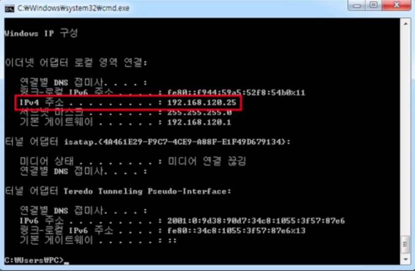
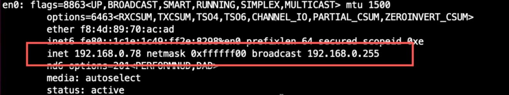
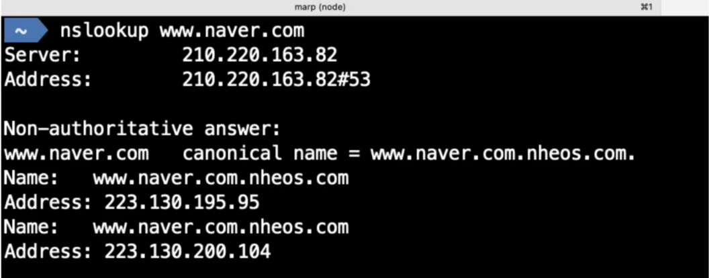
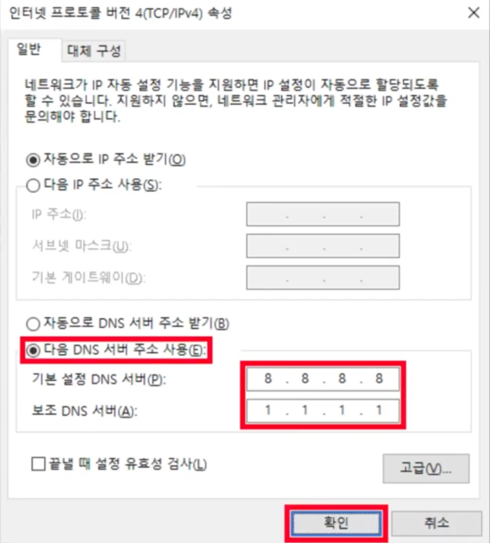
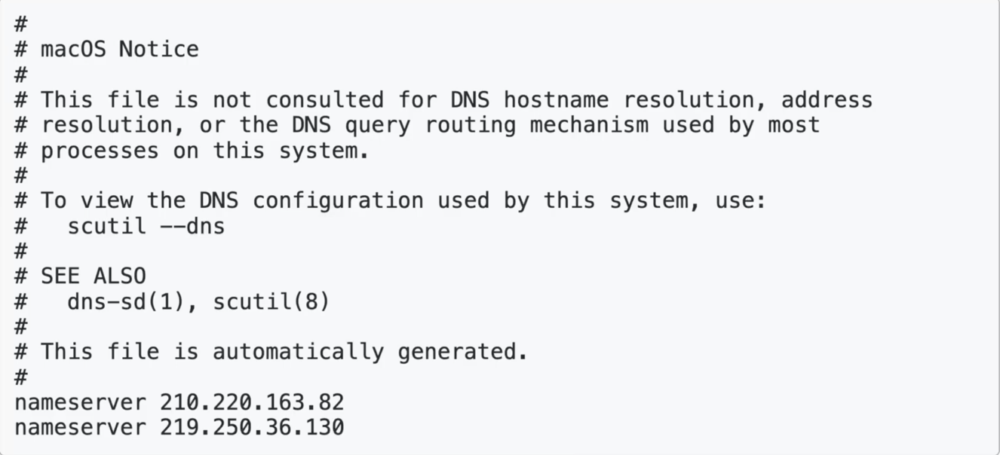

## 네트워크 프로그래밍

---
### IP 주소와 Port

* 컴퓨터를 구분하는 주소 : IP
* 컴퓨터 안에 있는 서버들을 구분하는 값 : Port

하나의 컴퓨터에는 여러 개의 서버가 실행될 수 있는데, 서버 프로그램들이 사용하는 구분값을 Port라고 한다.</br>
Port는 정수값이며, 같은 포트로 서버 여러 개가 함께 동작할 수 없음. → 서버 하나 당 Port 값은 다 다르게 동작해야 한다.

* 윈도우 사용자 : ipconfig 명령어 사용



* Mac 사용자 : ifconfig 명령어 사용



| 구분                         | 범위            | 설명                                        |
|----------------------------|---------------|-------------------------------------------|
| Well Known Port 번호         | 0 ~ 1023      | 국제 인터넷 주소 관리 기구(ICANN)에서 미리 예약해둔 포트       |
| Registered Port 번호         | 1024 ~ 49151  | 개인 또는 회사에서 사용하는 포트                        |
| Dynamic 또는 Private Port 번호 | 49152 ~ 65535 | 운영체제가 부여하는 동적 포트 또는 개인적인 목적으로 사용할 수 있는 포트 |

* 웹 서버는 기본이 80번 포트를 사용, FTP는 21번 포트를 사용
* 0 ~ 1023 안에 있는 포트들(Well Known Port)은 굉장히 중요한 서버, 많이 알려진 서버들이 사용하는 포트라고 생각하면 됨

---

### 127.0.0.1

* 컴퓨터 자신의 IP

---

### 도메인(Domain 주소)

>https://www.naver.com</br>
>https://www.daum.net</br>
>https://www.google.com

* https://www.naver.com, https://www.daum.net, https://www.google.com은 도메인 주소이다.

---

### 도메인 네임 서버 (Domain Name Server: DNS)

* 도메인 주소를 IP로 변환한다.
* nslookup 도메인 주소
  * 위의 명령으로 도메인에 해당하는 IP 주소를 알 수 있다. 



도메인 네임 서버가 설정이 되어 있지 않으면 주소를 적어도 IP를 찾을 수 없음.

---

### 윈도우에서 DNS 설정하기



### Mac, Linyx에서 DNS 설정하기

* /etc/resolv.conf 파일에서 설정한다.



네임서버도 서버이기 때문에 죽을 수도 있기 때문에, 서버가 죽었을 때 다음 서버가 실행될 수 있도록 보통 2개로 설정

---

### localhost

* 컴퓨터 자신의 도메인

---

### IP 주소 알아내기

* InetAddress 로 알아낸다.
* 사용자 컴퓨터의 IP 주소 알아내기
```text
InetAddress ia = InetAddress.getLocalHost();
System.out.println(ia.getHostAddress());
```
* google의 IP 주소 알아내기
```java
InetAddress[] isArr = InetAddress.getAllByName("www.google.com");
for(InetAddress ia : iaArr){
        System.out.println(ia.getHostAddress());
    }
```

### 예제 1
1. IpAddressExam01 클래스
```java
import java.net.InetAddress;

public class IpAddressExam01 {
    public static void main(String[] args) {
        try {
          InetAddress ia = InetAddress.getLocalHost(); // 내 컴퓨터의 IP 정보를 구한다. checkedException을 발생시키기 떄문에 반드시 Exception 처리를 해줘야 함
          System.out.println(ia.getHostAddress());
        }catch (UnKnownHostException uhe){
            uhe.printStackTrace();
        }
    }
}
```
출력 결과
```text
내 컴퓨터 IP 주소가 출력됨
```

### 예제 2

1. IpAddressExam02 클래스
```java
import java.net.InetAddress;
import java.net.UnknownHostException;

public class IpAddressExam02 {
    public static void main(String[] args) {
        try {
          InetAddress[] iaArray = InetAddress.getAllByName("www.google.com"); // 내 컴퓨터의 IP 정보를 구한다. checkedException을 발생시키기 떄문에 반드시 Exception 처리를 해줘야 함
            for(InetAddress ia : iaArray){ // 배열의 개수만큼 반복하며 출력
              System.out.println(ia.getHostAddress());
            }
        }catch (UnKnownHostException uhe){
            uhe.printStackTrace();
        }
    }
}
```
출력 결과
```text
142.251.220.36 (Inet4 형식)
2404:6800:4005:81c:0:0:0:2004 (Inet6 형식)
```
출력 결과 IP 주소가 2가지가 출력되는 것을 알 수 있다.
* 하나는 Inet4 주소이고 하나는 Inet6 주소이다. 
* IP가 고갈되고 있기 때문에 2가지 사용. 
  * 사람들이 사용하는 컴퓨터가 너무 많아 Inet4 형식으로는 모든 컴퓨터에게 할당해줄 수가 없음.
  * 그래서  Inet6 형식의 주소를 사용

---

### Client & Server 프로그래밍
* Socket : Server에 접속을 하는 역할
* ServerSocket : Client가 접속 요청을 기다리는 역할
  * Client 요청을 기다리다가 접속을 하면 Socket을 반환한다.
* Socket과 Socket 간에는 IO 객체를 이용하여 통신할 수 있다.


<br/><br/>

>**Reference**
><br/>부부개발단 - 즐겁게 프로그래밍 배우기.