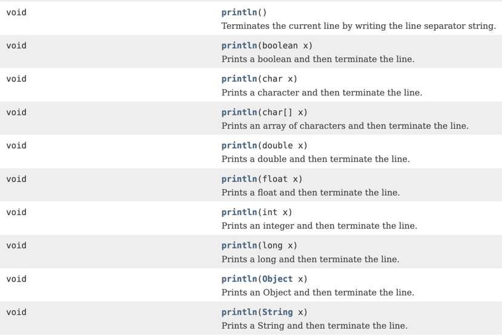

## 다형성

---
### 다형성 - 메소드 오버로딩(Overloading)
프로그래밍 언어의 자료형 체계의 성질을 나타낸 것으로, 프로그래밍 언어의 각 요소들(상수, 변수, , 오브젝트 함수, 메소드 등)이 다양한 자료형(type)에 속하는 것이 허가되는 성질을 말함   
**메소드의 이름은 같고 매개변수의 갯수나 타입이 다른 함수를 정의하는 것**  
**리턴 값만을 다르게 갖는 오버로딩은 작성할 수 없음**  
---
### System.out.println(...)

char[], double, float, int, long, object, String을 출력하는 다양한 println() 메소드가 10개 있음 
여기서 int를 출력햐든 double을 출력하는 메소드 이름은 println()으로 같음 
값이 뭐가 됐든 출력 후 줄바꿈 한다는 의미이니 메소드 이름을 다르게 지을 필요가 없음  

**이렇게 같은 이름의 메소드가 여러 개 있는데 매개 변수의 타입이 다르거나 매개 변수의 개수가 다른 경우를 오버로딩(Overloading) 했다고 말함.**  

>**Reference**
> 부부개발단 - 즐겁게 프로그래밍 배우기.