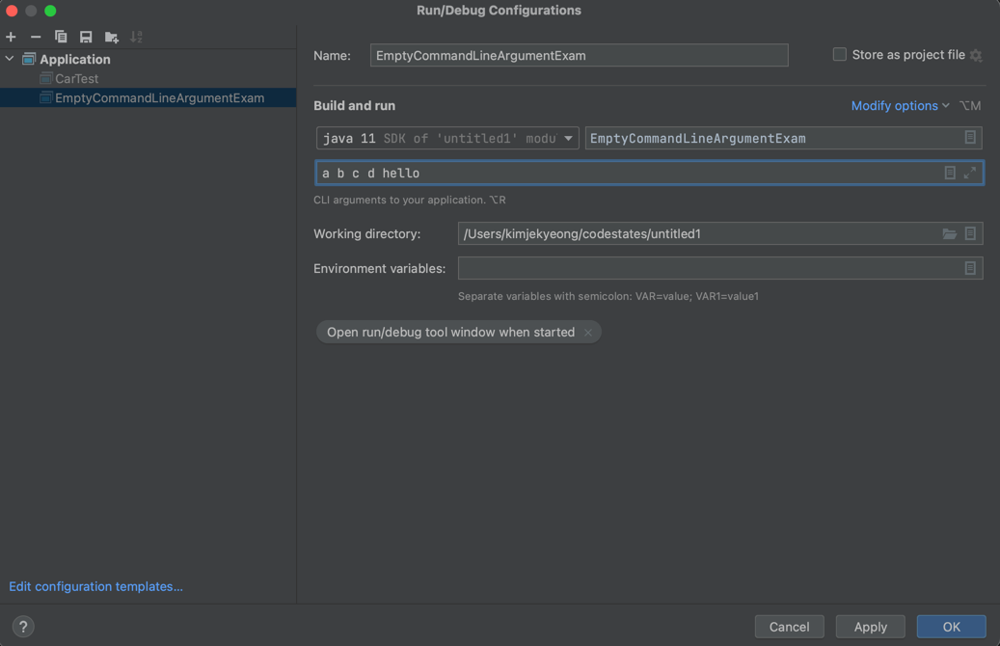
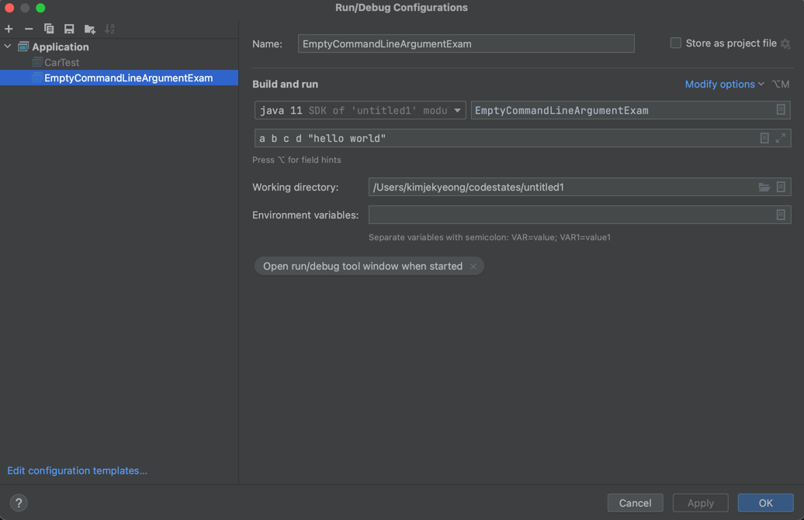

## 배열

---
### 배열

참조 타입<br/>
같은 타입의 변수가 여러 개 필요할 때 사용  <br/>
**배열을 선언한 뒤 반드시 배열 인스턴스로 초기화 해줘야만 ***NullPointerException*** 오류가 뜨지 않는다.**

---

### 기본형 배열
배열은 기본형 배열, 참조형 배열로 나뉘어진다.</br>
boolean, byte, short, char, int, long, float, double 타입의 변수를 여러 개 선언할 필요가 있을 때 사용</br></br>
### 기본형 배열 선언
```java
기본형 타입[] 변수명;
기본형 타입 변수명[];
```
타입이나 변수명 뒤에 선언할 수 있다</br></br>

---

### 예시 1
```java
public class Array01 {
    public static void main(String[] args) {
        // 배열 선언
        int[] array1;
        int array2[];
        int array3[];
        
        // 배열 변수를 선언했으면 반드시 초기화하는 과정이 있어야함.
        array1 = new int[5]; // 정수를 5개 가질 수 있는 배열 인스턴스를 선언
        array2 = new int[5]; // 정수를 5개 가질 수 있는 배열 인스턴스를 선언
        array3 = new int[0]; // ❗정수를 아무것도 가질 수 없는 배열 인스턴스를 선언

        System.out.println(array1.length);
        System.out.println(array1.length);
        System.out.println(array1.length); 
    }
}
```
출력 결과
```text
5
5
0
```

---

### 예시 2
```java
public class Array02 {
    public static void main(String[] args) {
        int[] array1, array2; // array1, array2는 모두 정수 배열
        int array3[], array4; // array3만 정수 배열, array4는 배열 ❌
    }
}
```

---

### 초깃값 있이 선언하기
```java
기본형 타입[] 변수명 = new 기본형 타입[배열의 크기];
변수명[index 값] = 값;
기본형 타입[] 변수명 = new 기본형 타입[]{값1, 값2, .... };
기본형 타입[] 변수명 = {값1, 값2, ....};
```

---

### 예시 3
```java
public class Array03 {
    public static void main(String[] args) {
        // array1, array2, array3 은 모두 같은 배열 선언 방법
        
        // 배열의 크기를 정해주고 파일, 키보드 입력 등 다양한 방법으로 값을 읽어들이고 초기화할 때 유리
        int array1 = new int[5];
        array1[0] = 1;
        array1[1] = 2;
        array1[2] = 3;
        array1[3] = 4;
        array1[4] = 5;
        
        // 배열을 선언함과 동시에 값을 초기화할 때 유리한 방식
        int[] array2 = new int[]{1, 2, 3, 4, 5};
        int[] array3 = {1, 2, 3, 4, 5};

        System.out.println("array1 의 값 출력");
        for(int i = 0; i < 5; i++){
            System.out.println(array1[i]);
        }        
        
        System.out.println("array2 의 값 출력");
        for(int i = 0; i < 5; i++){
            System.out.println(array2[i]);
        }        
        
        System.out.println("array3 의 값 출력");
        for(int i = 0; i < 5; i++){
            System.out.println(array3[i]);
        }
    }
}
```
출력 결과
```text
array1 의 값 출력
1
2
3
4
5
array2 의 값 출력
1
2
3
4
5
array3 의 값 출력
1
2
3
4
5
```

---

### 참조형 배열
배열의 타입이 기본형이 아닌 경우</br>
배열 변수가 참조하는 배열의 공간이 값을 저장하는 것이 아니라 값을 참조한다는 것을 의미

---

### 예시 1

1. 불변 클래스 ItemForArray
```java
public class ItemForArray {
    private int price;
    private String name;
    
    public ItemForArray(int price, String name){
        this.price = price;
        this.name = name;
    }
    
    public int getPrice() {
        return price;
    }
    
    public String getName() {
        return name;
    }
}
```
2. array04 클래스
```java
public class array04 {
    public static void main(String[] args) {
        // 배열 선언 (array1, array2 는 null인 상태)
        ItemForArray[] array1;
        ItemForArray array2[];
        
        // 배열 초기화 (array1, array2는 각각 5개의 ItemForArray를 참조하는 배열)
        array1 = new ItemForArray[5];
        array2 = new ItemForArray[5];
        
        array1[0] = new ItemForArray(500, "item01");
        array1[1] = new ItemForArray(1000, "item02");

        System.out.println(array1[0].getName());
        System.out.println(array1[2].getName()); // 현재 array1[2] 참조하는 것이 없으므로 오류 뜸
    }
}
```
3. 출력 결과
```text
item01
🚫NullPointerException🚫
```

---

### 예시 2

```java
public class Array05 {
    public static void main(String[] args) {
        ItemForArray[] array1 = new ItemForArray[3];
        array1[0] = new ItemForArray(500, "사과");
        array1[1] = new ItemForArray(300, "바나나");
        array1[2] = new ItemForArray(900, "수박");
        
        // 선언과 동시에 초기화 (인스턴스를 3개 만들어서 배열에 바로 넣어줌)
        ItemForArray[] array2 = new ItemForArray[]{new ItemForArray(500, "사과"), new ItemForArray(300, "바나나"), new ItemForArray(900, "수박")};
        ItemForArray[] array3 = {new ItemForArray(500, "사과"), new ItemForArray(300, "바나나"), new ItemForArray(900, "수박")};

        System.out.println(array1[0].getName());
        System.out.println(array1[0].getPrice());        
        System.out.println(array1[1].getName());
        System.out.println(array1[1].getPrice());        
        System.out.println(array1[2].getName());
        System.out.println(array1[2].getPrice());
        
        // array2, array3도 동일한 결과
    }
}
```
출력 결과
```text
사과
500
바나나
300
수박
900
```

---

### 배열의 길이 구하기
배열은 length 필드를 가진다.
```java
public class Array06 {
    public static void main(String[] args) {
        // 선언만 했을 경우, 배열 안에는 모두 0의 값이 들어가게 됨
        double[] array1 = new double[5];
        // 선언과 동시에 초기화
        double[] array2 = {1.5, 2.4, 3.5};
        // array3, array4는 같은 형태 (참조하는 것이 없음)
        double[] array3;
        double[] array4 = null;

        System.out.println(array1.length);
        System.out.println(array1[0]);
        System.out.println(array1[1]);
        System.out.println(array1[2]);
        System.out.println(array1[3]);
        System.out.println(array1[4]);
        
        System.out.println("---------------");
        
        System.out.println(array2.length);
        System.out.println(array3.length); // 오류 
        System.out.println(array4.length); // 오류
    }
}
```
출력 결과
```text
5
0.0
0.0
0.0
0.0
0.0
---------------
3
🚫NullPointerException🚫
🚫NullPointerException🚫
```
**배열을 선언한 뒤 반드시 배열 인스턴스로 초기화 해줘야만 ***NullPointerException*** 오류가 뜨지 않는다.**

---
### ArrayIndexOutOfBoundsExceptions
```java
public class Array07 {
    public static void main(String[] args) {
        double[] array = {1.5, 2.4, 3.5};

        System.out.println(array[0]);
        System.out.println(array[1]);
        System.out.println(array[2]);
        System.out.println(array[3]); // 배열이 범위는 0, 1, 2까지이기 때문에 오류
        
        System.out.println("---------------");
        double[] array2 = new double[0];
        System.out.println(array2.length);
        System.out.println(array2[0]); // 배열의 길이가 없으므로 0번째 인덱스 값도 없기 때문에 오류
    }
}
```
```text
1.5
2.4
3.5
🚫ArrayIndexOutOfBoundsExceptions🚫
---------------
0
🚫ArrayIndexOutOfBoundsExceptions🚫

```

---

### 이차원 배열
배열의 배열 (배열이 또 배열을 가질 수 있다)
```java
타입 [][] 변수명 = new 타입 [행의 수][열의 수];
변수명 [행인덱스][열인덱스] = 값;
```

---

### 예시
```java
public class Array08 {
    public static void main(String[] args) {
        int[][] array = new int[2][3];
        array[0][0] = 0;
        array[0][1] = 1;
        array[0][2] = 2;
        
        array[1][0] = 3;
        array[1][1] = 4;
        array[1][2] = 5;
        
        for (int i = 0; i < array.length; i++) { // 0부터 2보다 작을 때까지 반복
            for (int j = 0; j < array[i].length; j++) {
                System.out.println(array[i][j] + "\t");
            }
            System.out.println();
        }
    }
}
```
```text
0   1   2
3   4   5
```

---

### 이차원 배열 선언과 초기화

### 예시
```java
public class Array09 {
    public static void main(String[] args) {
        // 선언과 동시에 초기화
        int[][] array = {{0, 1, 2}, {3, 4, 5}};
        
        for (int i = 0; i < array.length; i++) { // 0부터 2보다 작을 때까지 반복
            for (int j = 0; j < array[i].length; j++) {
                System.out.println(array[i][j] + "\t");
            }
            System.out.println();
        }
    }
}
```
```text
0   1   2
3   4   5
```

---

### 이차원 가변 배열의 선언과 초기화

```java
타입 [][] 변수명 = new 타입 [행의 수][];
변수명 [행의 인덱스] = new 타입 [열의 수];
```
자바에서의 배열은 가변배열이 될 수 있음.</br>
배열 선언 시, 열의 수는 정해주지 않을 수가 있음.</br>
초기화 시, 정해지지 않은 열의 수를 나중에 선언하여 초기화해줄 수 있음.
```java
int[][] = koreanScoreArray = new int[3][];
koreanScoreArray[0] = new int[20];
koreanScoreArray[1] = new int[19];
koreanScoreArray[2] = new int[21];
```
`koreanScoreArray`의 0번째 배열은 20개짜리 배열을 참조할 수 있고,</br>
`koreanScoreArray`의 1번째 배열은 19개의 배열을 참조할 수 있고,</br>
`koreanScoreArray` 2번째 배열은 21개의 배열을 참조할 수 있다는 뜻</br>

```java
public class Array10 {
    public static void main(String[] args) {
        int[][] array = new int[2][];
        array[0] = new int[2];
        array[1] = new int[3];
        
        array[0][0] = 0;
        array[0][1] = 1;
        array[1][0] = 2;
        array[1][1] = 3;
        array[1][2] = 4;
        
        for (int i = 0; i < array.length; i++) { // 0부터 2보다 작을 때까지 반복
            for (int j = 0; j < array[i].length; j++) { // array[0]의 길이는 2, array[1]의 길이는 3이므로 그 전까지 반복
                System.out.println(array[i][j] + "\t");
            }
            System.out.println();
        }
    }
}
```
```text
0   1
2   3   4
```
```java
public class Array11 {
    public static void main(String[] args) {
        // 선언과 동시에 초기화
        int[][] array = {{0, 1}, {2, 3, 4}};
        
        for (int i = 0; i < array.length; i++) { // 0부터 2보다 작을 때까지 반복
            for (int j = 0; j < array[i].length; j++) { // array[0]의 길이는 2, array[1]의 길이는 3이므로 그 전까지 반복
                System.out.println(array[i][j] + "\t");
            }
            System.out.println();
        }
    }
}
```
```text
0   1
2   3   4
```

이러한 가변 배열이 사용되는 경우? </br>
ex. 학생의 점수를 입력받는 배열 (여러 반이 있는데 각각의 반에 학생의 수가 다를 때)

---

### `for each` 문
```java
for (타입 변수명 : 배열명) {
        ...
}
```
예시 1
```java
public class Array12 {
    public static void main(String[] args) {
        int[] array = {1, 2, 3, 4, 5};
        
//        for (int i = 0; i < array.length; i++) {
//            System.out.println(array[i]);
//        }
        
        // 위와 같은 코드
        for (int i : array) {
            System.out.println(i);
        }
    }
}
```
```text
1
2
3
4
5
```
예시 2
```java
public class Array13 {
    public static void main(String[] args) {
        ItemForArray[] array = new ItemForArray[3];
        array[0] = new ItemForArray(500, "사과");
        array[1] = new ItemForArray(300, "바나나");
        array[2] = new ItemForArray(900, "수박");
        
        for (ItemForArray item : array) {
            System.out.println(item.getName());
            System.out.println(item.getPrice());
        }
    }
}
```
```text
사과
500
바나나
300
수박
900
```
배열에 있는 것을 몽땅 꺼내서 하나씩 결과를 실행하고 싶을 때 `for each` 문을 사용하면 편리함.

---

### `Arrays`
자바가 제공해주는 클래스</br>
배열을 다룰 때 사용하는 유틸리티

```java
public class Array14 {
    public static void main(String[] args) {
        int[] copyFrom = {1, 2, 3};
        
        // 클래스명 앞에 java.util.Arrays를 붙혀주거나 import문을 사용해도 됨
        // copyFrom(소스)과 copyFrom.length(배열의 길이)를 넣어줌으로써
        // copyFrom에 있는 것들이 복사가 되어 copyTo가 만들어짐
        int[] copyTo = java.util.Arrays.copyOf(copyFrom, copyFrom.length);
        
        for (int c = copyTo) {
            System.out.println(c);
        }
        
        System.out.println("------------------------------");
        
        // copyFrom에 있는 것들을 포함해 5개짜리 배열이 만들어짐. 나머지 값은 0으로 채워짐
        int copyTo2 = java.util.Arrays.copyOf(copyFrom, 5);
        
        for (int c : copyTo2) {
            System.out.println(c);
        }
    }
}
```
```text
1
2
3
------------------------------
1
2
3
0
0
```
`Arrays.copyOf(copyFrom, copyFrom.length);`와 `= copyFrom;`의 차이?
```java
public class Array15 {
    public static void main(String[] args) {
        int[] copyFrom = {1, 2, 3};
        
        // copyFrom 배열의 3번째 길이까지 복사
        int[] copyTo = java.util.Arrays.copyOf(copyFrom, copyFrom.length);
        
        if (copyTo == copyFrom) {
            System.out.println("copyTo == copyFrom");
        } else {
            System.out.println("copyTo != copyFrom");
        }
        
        for (int c = copyTo) {
            System.out.println(c);
        }
        
        System.out.println("------------------------------");
        
        int[] copyTo3 = copyFrom;
        for (int c : copyTo3) {
            System.out.println(c);
        }
    }
}
```
```text
copyTo != copyFrom
1
2
3
------------------------------
1
2
3
```
`copyFrom`과 `copyTo3`는 같다고 선언했기 때문에 같은 것을 참조하게 됨</br>
하지만, `Arrays.copyOf`는 `copyFrom`에 있는 내용을 복사하면서 메모리에 새로운 배열을 생성하는 것과 같으므로</br>
`copyTo`와 `copyFrom`는 서로 다른 배열 인스턴스를 참조하게 됨</br></br>

**즉, 배열을 복사하는 것과 같은 배열을 참조한다는 것은 완전히 다른 이야기다!!!**

---

### 깊은 복사와 얕은 복사 (Todo)

같은 것을 참조하느냐? 아니면 진짜로 복사가 이루어지느냐?</br>
어떠한 객체나 배열을 복사하거나 할 때, 깊은 복사냐 얕은 복사냐에 따라 동작이 달라질 수 있음.

이에 대한 조사를 한 번 해보기

---
### `Arrays.copyOfRange`

배열 중 일부분만 복사하여 배열을 만들어줄 수 있음
```java
// import문 사용
// java.lang 패키지의 클래스는 import를 하지 않아도 사용 가리
import java.util.Arrays;

public class Array16 {
    public static void main(String[] args) {
        char[] copyFrom = {'h', 'e', 'l', 'l', 'o', '!'};
        
// import문 사용하지 않았을 때
// char[] copyTo = java.util.Arrays.copyOfRange(copyFrom, 1, 3);

        // copyFrom 배열을 인덱스 1번째부터 3번째 전까지 복사한다
        char[] copyTo = Arrays.copyOfRange(copyFrom, 1, 3);
        
        for (char c : copyTo) {
            System.out.println(c);
        }
    }
}
```
```text
e
l
```

---

### `Arrays.compare`
두 개의 배열을 비교하여(x, y) 왼쪽 값이 크면 1, 왼쪽 값이 작으면 -1, 같으면 0을 반환

```java
import java.util.Arrays;

public class Array17 {
    public static void main(String[] args) {
        int[] array1 = {1, 2, 3, 4, 5};
        int[] array2 = {1, 2, 3, 4, 5};
        int[] array3 = {1, 2, 3, 4, 6};
        int[] array4 = {1, 2, 3, 4, 6, 7, 8};
        int[] array5 = {1, 2, 3, 4, 4};
        
        // 양수, 0, 음수 (비교할 때)
        // x - y = 결과 (왼쪽 값이 크면 양수, 왼쪽 값이 작으면 음수, 같으면 0)
        int compare1 = Arrays.compare(array1, array2);
        int compare2 = Arrays.compare(array1, array3);
        int compare3 = Arrays.compare(array1, array4);
        int compare4 = Arrays.compare(array1, array5);

        System.out.println(compare1);
        System.out.println(compare2);
        System.out.println(compare3);
        System.out.println(compare4);
    }
}
```
```text
0
-1
-1
1
```

---

### `Arrays.sort`
배열을 순서대로 정렬하여 반환
```java
import java.util.Arrays;

public class Array18 {
    public static void main(String[] args) {
        int[] array = {5, 4, 3, 1, 2};
        
        Arrays.sort(array);
        
        for (int i : array) {
            System.out.println(i);
        }
    }
}
```
```text
1
2
3
4
5
```

---

### `Arrays.binarySearch`
정렬된 배열에서 검색하는 메소드 (배열이 섞여있다면 `Arrays.sort` 메소드를 통해 정렬 필요)
```java
import java.util.Arrays;

public class Array19 {
    public static void main(String[] args) {
        int[] array = {5, 4, 3, 1, 2};
        
        Arrays.sort(array);
        
        // array 배열에서 4가 있는 인덱스값을 찾아라
        int i = Arrays.binarySearch(array, 4);
        System.out.println(i);
    }
}
```
```text
3
```

---

### `Arrays.sort` 예시 1 (오류)
1. Item 클래스
```java
public class Item {
    private String name;
    private int price;

    // 생성자
    public Item(String name, int price) {
        this.name = name;
        this.price = price;
    }
    
    // getter, setter 메소드
    public String getName() {
        return name;
    }

    public void setName(String name) {
        this.name = name;
    }

    public int getPrice() {
        return price;
    }

    public void setPrice(int price) {
        this.price = price;
    }
    
    // toString 메소드
    @Override
    public String toString() {
        return "Item{" +
                "name='" + name + '\'' +
                ", price=" + price +
                '}';
    }
}
```
2. Array 클래스
```java
public class Array {
    public static void main(String[] args) {
        Item[] items = new Item[5];
        items[0] = new Item("java", 5000);
        items[1] = new Item("파이썬", 4000);
        items[2] = new Item("C#", 4500);
        items[3] = new Item("자바스크립트", 6000);
        items[4] = new Item("Dart", 2000);
        
        // 여기서 Arrays.sort 메소드를 이용해 정렬을 하고싶다면?
        // sort(Object[]) - Object는 모든 객체의 조상이기 때문에 어떤 객체의 배열이든 올 수 있다.
        Arrays.sort(items);
        
        for (Item item : items) {
            System.out.println(item);
        }
    }
}
```
3. 출력 결과
```text
🚫ClassCastException 오류🚫 → Item 클래스는 Comparable 인터페이스로 캐스할 수 없다라는 오류가 뜸
```

---

### `Arrays.sort` 예시 1 (해결 - name 순 정렬)
✅ 정렬을 할 때 기준을 정해줘야 함 → Comparable 인터페이스의 구현 필요
1. Item 클래스 (Comparable 인터페이스 구현)</br>
Comparable 는 어떤 Item이 큰지, 작은지 기준을 정하는 인터페이스
```java
// Comparable 는 어떤 Item이 큰지, 작은지 기준을 정하는 인터페이스
public class Item implements Comparable{
    private String name;
    private int price;

    // 생성자
    public Item(String name, int price) {
        this.name = name;
        this.price = price;
    }
    
    // ✅ Comparable 인터페이스가 갖고있는 CompareTo 메소드 오버라이딩
    // CompareTo는 파라미터로 들어온 Object와 내 자신을 비교하는 메소드
    // CompareTo는 Object를 받아들이도록 했지만 실제로는 Item이 들어옴
    @Override
    public int CompareTo(Object o) {
        // 파라미터로 들어온 Object를 Item으로 형 변환
        Item d = (Item) o;
        // 파라미터로 들어온 Item의 이름과 자기자신의 이름을 비교하여 자기자신이 크면 양수, 같으면 0, 작으면 음수
        return this.name.compareTo(d.name);
    }
    
    // getter, setter 메소드
    public String getName() {
        return name;
    }

    public void setName(String name) {
        this.name = name;
    }

    public int getPrice() {
        return price;
    }

    public void setPrice(int price) {
        this.price = price;
    }
    
    // toString 메소드
    @Override
    public String toString() {
        return "Item{" +
                "name='" + name + '\'' +
                ", price=" + price +
                '}';
    }
}
```
2. Array 클래스
```java
public class Array {
    public static void main(String[] args) {
        Item[] items = new Item[5];
        items[0] = new Item("java", 5000);
        items[1] = new Item("파이썬", 4000);
        items[2] = new Item("C#", 4500);
        items[3] = new Item("자바스크립트", 6000);
        items[4] = new Item("Dart", 2000);
        
        // 여기서 Arrays.sort 메소드를 이용해 정렬을 하고싶다면?
        // sort(Object[]) - Object는 모든 객체의 조상이기 때문에 어떤 객체의 배열이든 올 수 있다.
        Arrays.sort(items);
        
        for (Item item : items) {
            System.out.println(item);
        }
    }
}
```
3. 출력 결과 (유니코드 상 순서대로 나올 것임)</br>
영어는 알파벳 대문자부터 ~ 소문자 순, 한글은 가나다 순
```text
Item{name='C#', price=4500}
Item{name='Dart', price=2500}
Item{name='java', price=5000}
Item{name='자바스크립트', price=6000}
Item{name='파이썬', price=4000}
```

---

### `Arrays.sort` 예시 1 (해결 - price 순 정렬)
✅ 정렬을 할 때 기준을 정해줘야 함 → Comparable 인터페이스의 구현 필요
1. Item 클래스 (Comparable 인터페이스 구현)</br>
   Comparable 는 어떤 Item이 큰지, 작은지 기준을 정하는 인터페이스
```java
// Comparable 는 어떤 Item이 큰지, 작은지 기준을 정하는 인터페이스
public class Item implements Comparable{
    private String name;
    private int price;

    // 생성자
    public Item(String name, int price) {
        this.name = name;
        this.price = price;
    }
    
    // ✅ Comparable 인터페이스가 갖고있는 CompareTo 메소드 오버라이딩
    // CompareTo는 파라미터로 들어온 Object와 내 자신을 비교하는 메소드
    // CompareTo는 Object를 받아들이도록 했지만 실제로는 Item이 들어옴
    @Override
    public int CompareTo(Object o) {
        // 파라미터로 들어온 Object를 Item으로 형 변환
        Item d = (Item) o;
        // 파라미터로 들어온 가격과 자기 자신의 가격을 비교하는 것이므로
        // 자가자신의 가격과 파라미터로 들어온 가격의 차이를 리턴, 0보다 크면 양수, 같으면 0, 0보다 작으면 음수
        return this.price - d.price;
    }
    
    // getter, setter 메소드
    public String getName() {
        return name;
    }

    public void setName(String name) {
        this.name = name;
    }

    public int getPrice() {
        return price;
    }

    public void setPrice(int price) {
        this.price = price;
    }
    
    // toString 메소드
    @Override
    public String toString() {
        return "Item{" +
                "name='" + name + '\'' +
                ", price=" + price +
                '}';
    }
}
```
2. Array 클래스
```java
public class Array {
    public static void main(String[] args) {
        Item[] items = new Item[5];
        items[0] = new Item("java", 5000);
        items[1] = new Item("파이썬", 4000);
        items[2] = new Item("C#", 4500);
        items[3] = new Item("자바스크립트", 6000);
        items[4] = new Item("Dart", 2000);
        
        // 여기서 Arrays.sort 메소드를 이용해 정렬을 하고싶다면?
        // sort(Object[]) - Object는 모든 객체의 조상이기 때문에 어떤 객체의 배열이든 올 수 있다.
        Arrays.sort(items);
        
        for (Item item : items) {
            System.out.println(item);
        }
    }
}
```
3. 출력 결과 (가격이 작은 것부터 높은 것 순서대로 출력)
```text
Item{name='Dart', price=2500}
Item{name='파이썬', price=4000}
Item{name='C#', price=4500}
Item{name='java', price=5000}
Item{name='자바스크립트', price=6000}
```

---

### `Arrays.sort` 예시 1 (해결 - 외부에 정렬 방법 정의 `Comparator` 인터페이스 구현)
1. Item 클래스 (Comparable 인터페이스 구현)</br>
```java
public class Item implements Comparable{
    private String name;
    private int price;
    
    public Item(String name, int price) {
        this.name = name;
        this.price = price;
    }
    
    @Override
    public int CompareTo(Object o) {
        Item d = (Item) o;
        return this.price - d.price;
    }
    
    public String getName() {
        return name;
    }

    public void setName(String name) {
        this.name = name;
    }

    public int getPrice() {
        return price;
    }

    public void setPrice(int price) {
        this.price = price;
    }
    
    @Override
    public String toString() {
        return "Item{" +
                "name='" + name + '\'' +
                ", price=" + price +
                '}';
    }
}
```
2. Array 클래스
```java
public class Array {
    public static void main(String[] args) {
        Item[] items = new Item[5];
        items[0] = new Item("java", 5000);
        items[1] = new Item("파이썬", 4000);
        items[2] = new Item("C#", 4500);
        items[3] = new Item("자바스크립트", 6000);
        items[4] = new Item("Dart", 2000);
        
        // ✅ 여기에 파라미터로 items와 외부에서 정의한 정렬방법을 넣어준다
        // Arrays.sort(items, 외부에서 정의한 정렬 방법);
        
        // 방법 1
        Arrays.sort(items, new ItemSorter());
        
        // 방법 2 (ItemSorter는 메소드가 하나만 있는 인터페이스이므로 위 코드를 람다식으로 바꿔줄 수 있음)
        Arrays.sort(items, new Comparator{
          @Override
          public int compare(Object o1, Object o2) {
             Item item1 = (Item) o1;
             Item item2 = (Item) o2;
             return item1.getName().compareTo(item2.getName());
          }
        });
       
         // 방법 3 (ItemSorter는 메소드가 하나만 있는 인터페이스이므로 위 코드를 람다식으로 바꿔줄 수 있음)
          Arrays.sort(items, (Object o1, Object o2) -> {
                Item item1 = (Item) o1;
                Item item2 = (Item) o2;
                return item1.getName().compareTo(item2.getName());
             }
          );

          // 방법 4 (자동으로 유추가 가능하기 때문에 Object 대신 item1, item2로 바꿔줘도 됨, return도 생략이 가능)
          Arrays.sort(items, (item1, item2) ->  item1.getName().compareTo(item2.getName()));
       
       for (Item item : items) {
            System.out.println(item);
        }
    }
}
```
3. ItemSorter 클래스 (`Comparator` 인터페이스 클래스 구현)
```java
public class ItemSorter implements Comparator{
    // o1 - o2 결과가 양수면 o1이 크다, 같으면 같다, 음수면 o1이 작다
    @Override
    public int compare(Object o1, Object o2) {
        // Item으로 형변환
        Item item1 = (Item) o1;
        Item item2 = (Item) o2;
        
        // item1의 이름과 item2의 이름을 비교
        return item1.getName().compareTo(item2.getName());
    } 
}
```
3. 출력 결과
```text
Item{name='C#', price=4500}
Item{name='Dart', price=2500}
Item{name='java', price=5000}
Item{name='자바스크립트', price=6000}
Item{name='파이썬', price=4000}
```
***`Comparator` 인터페이스를 구현한 객체를 만들어서 직접 넣어줄 수도 있고</br>
`Comparator` 인터페이스를 구현한 이름 없는 객체를 사용할 수도 있으며</br>
여기서 이름없는 객체 일부를 람라 표현식으로 선언하여 코드를 개선해나갈 수 있다!!!***

---

### 명령 행 아규먼트(Command-Line Arguments) 
여태까지 가장 많이 사용된 배열은 main 메소드에 있는 String[] args</br>
```java
public class Array {
   public static void main(String[] args) {
      ...
   }
}
```
이 args라는 변수를 명령 행 아규먼트라고 함.</br>
main 메소드는 JVM이 실행하는 메소드이다.</br>
JVM이 main 메소드를 실행할 때 String[] 아규먼트로 넘겨준다는 것을 의미한다.

```java
public class EmptyCommandLineArgumentExam {
   public static void main(String[] args) {
      System.out.println(args.length);
      
//      JVM이 0개짜리 배열을 생성하여 이런 식으로 실행해주는 것과 같음
//      String[] args = new String[0];
//      main(args);
   }
}
```
출력 결과
```text
0
```
✅ Program arguments 에 a b c d hello 추가한 뒤 컴파일

출력 결과
```text
5
```

---

### 예시

```java
public class CommandLineArgumentExam {
   public static void main(String[] args) {
      if(args.length == 0){
         System.out.println("사용법 : CommandLineArgumentExam 값 값 ....");
         System.exit(0); // exit 0 값을 갖고 프로그램을 종료하라는 뜻, return; 으로 변경 가능
      }

      for (String arg : args){
         System.out.println(arg);
      }
   }
}
```
```text
사용법 : CommandLineArgumentExam 값 값 ....
```
✅ Program arguments 에 a b c d "hello world" 추가한 뒤 컴파일

```text
a
b
c
d
hello world
```
큰 따옴표로 묶인 것은 하나의 문자열로 취급

---

### 제한 없는 아규먼트(unlimited arguments)
경우에 따라 메소드 아규먼트를 가변적으로 전달하고 싶은 경우가 있다.</br>
메소드에 정수값을 경우에 따라 각각 3개, 5개를 넘기고 싶다면?

```java
리턴 타입 메소드 이름 (타입... 변수명) {
        ...
}
```
예시
```java
public class UnlimitedArgumentsExam{
   public static void main(String[] args) {
      System.out.println(sum());
      System.out.println(sum(5, 10));
      System.out.println(sum(1, 2, 4, 2));
      System.out.println(sum(3, 1, 2, 3, 4, 1));
   }
   
   // static 메소드
   // ✅ int... 은 제한없는 아규먼트라는 뜻 (정수를 여러 개 받을 수 있다)
   public static int sum(int... args){
      System.out.println("print1 메소드 - args 길이 : " + args.length);
      int sum = 0;
      
      // i는 0부터 args.length까지 반복하면서 args[i]번쨰를 sum에 누적하라
      for (int i = 0; i < args.length; i++) {
          sum += args[i];
      }
      return sum;
   }
}
```
출력 결과
```text
print1 메소드 - args 길이 : 0
0
print1 메소드 - args 길이 : 2
15
print1 메소드 - args 길이 : 4
9
print1 메소드 - args 길이 : 6
14
```
<br/><br/>

>**Reference**
><br/>부부개발단 - 즐겁게 프로그래밍 배우기.