## 쓰레드 (Thread)

---

### 성능 향상시키기

B는 병렬화시킬 수 없는 부분(동시에 실행시킬 수 없는 부분)

1-B는 병렬화가 가능한 부분(동시에 실행이 가능한 부분)이라 했을 때
 
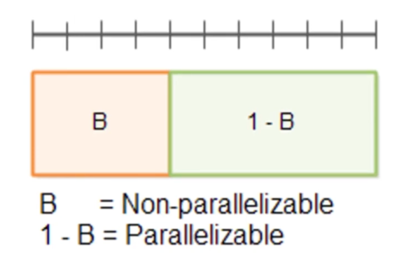

병렬화 가능한 부분을 2부분으로 나눌 수도 있고, (남은 3칸만큼 시간 향상)

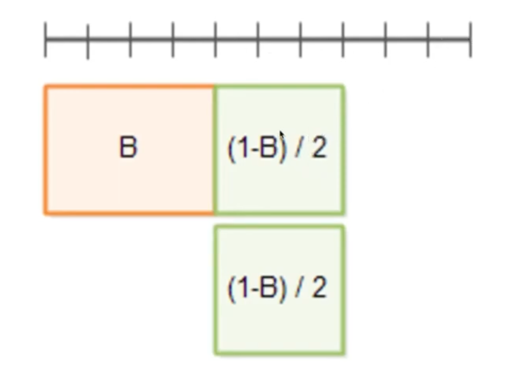

3부분으로 나눌 수도 있다. (남은 4칸만큼 시간 향상)

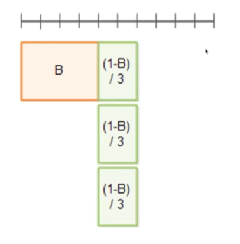

병렬화 가능한 부분을 나눌 수록 더욱 더 많은 시간을 향상시킬 수 있음!

B라는 부분은 병렬화 가능하지 않은 부분(동시에 실행시킬 수 없는)이기 때문에 성능은 한없이 향상시킬 수는 없다.

→ 따라서, B부분에서는 성능이 떨어지는 문제가 발생할 수 있음!


---

### 병렬화 할 때 고려해야 할 것들

* 메모리의 속도
* CPU 캐시 메모리
* 디스크
* 네트워크
* 컨넥션
* 순차적 실행이 병렬실행보다 빠른 경우도 있다.</br>
  (동시 실행에 따르는 오버헤드가 없고, 단일 CPU 알고리즘은 하드웨어 작업에 더 친화적일 수 있기 때문)
* 기타

---

### 암달의 법칙 (Amdahl's Law)

* 암달의 저주로도 불리며 컴퓨터 시스템의 일부를 개선할 때, 전체적으로 얼마만큼의 최대 성능 향상이 있는지 계산하는데 사용된다.
* 론(theory)만 많은 컴퓨터 과학 분야에서 몇 안되는 법칙(Law)이다.

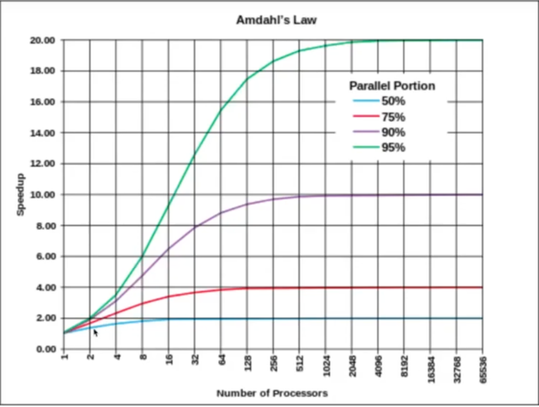
* 병렬 컴퓨팅을 할 경우, 일부 병렬화 가능한 작업들은 사실상 계산에 참여하는 컴퓨터의 개수에 비례해서 속도가 늘어난다. 
* 이러한 경우 암달의 법칙에 의해 전체 수행시간의 개선 효과는 병렬화가 불가능한 작업들의 비중에 크게 영향을 받게 된다.
* 즉, 아무리 컴퓨터 개수가 늘어나더라도 위의 그림에서 보는 것처럼 **속도의 한계는 정해져 있다는 것**

***병렬화가 불가능한 부분 때문에, 컴퓨터가 아무리 늘어나도 어느 순간에서는 성능이 더 이상 향상되지 못하는 경우가 있다 ❗️***

---

### 윈도우 작업관리자에서 프로세스 보기
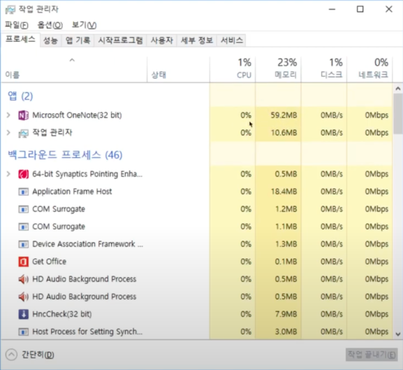

현재 실행되고 있는 프로그램들 목록이 나옴 (동시에 실행되고 있다는 뜻)

각각의 프로세스별로 CPU, 메모리는 얼만큼 사용하는지 정보가 표시되어 있음.

---

### Mac 활성상태보기에서 프로세스 보기
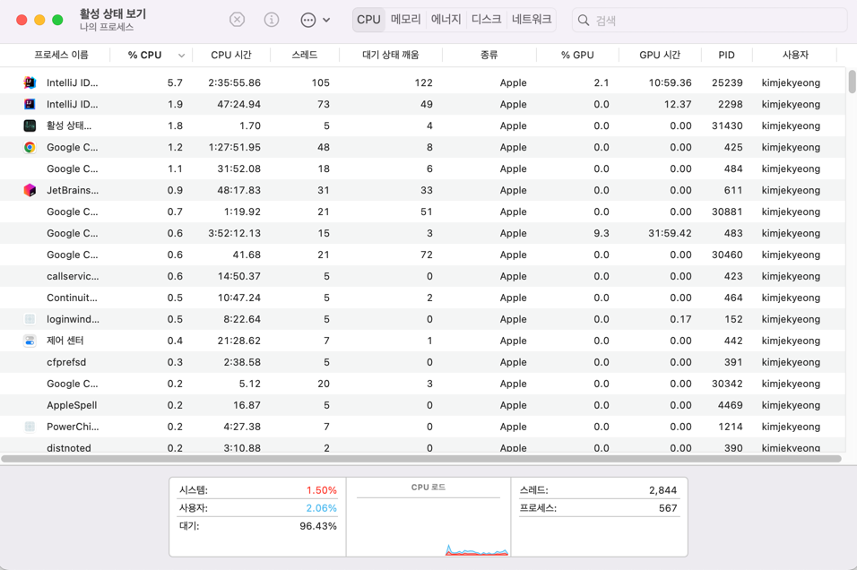

Cmd(커맨드) + Space(스페이스) 키를 눌러 "활성 상태 보기"를 입력하면 볼 수 있다.


***각각의 프로세스들은 자신만의 메모리 영역을 확보한 상태로 실행되고 있다!***

---

### Context Switching

* 현재 진행하고 있는 Task(Process, Thread)의 상태를 저장하고 다음 진행할 Task의 상태 값을 읽어 적용하는 과정
* Context Switching이 발생할 때, 시간이 걸리는 편 (오버헤드가 발생)

---

### Process
* 각각의 프로세스는 메모리 공간에서 독립적으로 존재한다.
* 각각의 프로세스는 자신만의 메모리 구조를 가진다. (Stack, Heap, Data, BSS, Text 등)
* 프로세스 A, B, C가 있을 경우 각각 프로세스는 모두 같은 구조의 메모리 공간을 가진다.
* 독립적인 만큼 다른 프로세스의 메모리 공간에 접근할 수 없다.

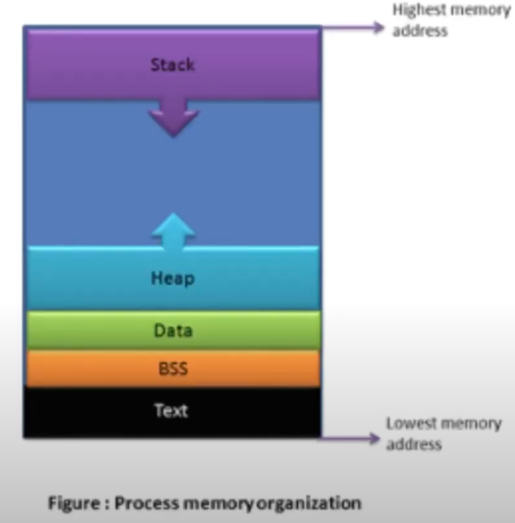

---

### IPC (프로세스 간 통신 방법)
* 프로세스 A에서 프로세스 B를 직접 접근할 수 없기 때문에 프로세스 간의 통신을 하는 특별한 방식이 필요하다.
* 메일슬록(mailslot), 파이프(pipe) 등이 바로 프로세스 간의 통신. 즉, IPC의 예들이다.
* 프로세스는 독립적인 메모리 공간을 지니기 때문에 IP를 통하지 않고 통신할 수 없다.
* 프로세스가 여럿이 병렬적으로 실행되기 위해서는 필연적으로 컨텍스트 스위칭(Context Switching)이 발생할 수 밖에 없다.
* 이것을 해결할 수 있는 것이 스레드(Thread) 이다.

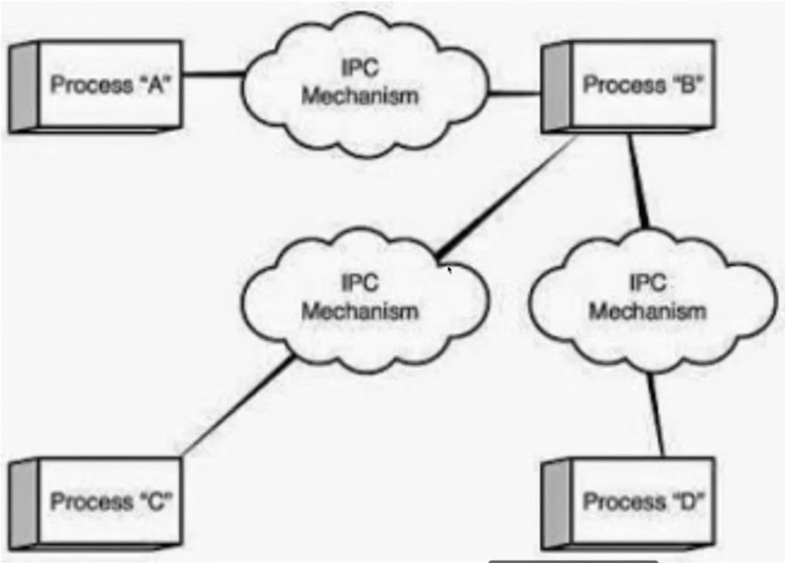

---

Thread
* 스레드는 하나의 프로그램 내에 존재하는 여러 개의 실행 흐름을 위한 모델이다.
* 우리가 생각하는 프로그램이 실행되기 위해서 하나의 실행 흐름으로 처리할 수도 있지만, 다수의 실행 흐름으로 처리할 수도 있다.
* 스레드는 프로세스와 별개가 아닌 프로세스를 구성하고 실행하는 흐름이다.
* 즉, 컴퓨터 안에서 프로세스들이 동시에 실행될 수 있는데, 이 프로세스 안에서 스레드가 또 여러 흐름이 있을 수 있음.

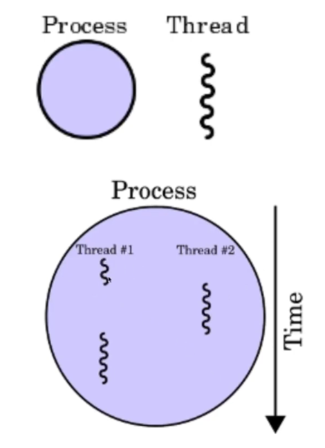

하나의 프로세스 안에서 꼬불꼬불한거(스레드)가 여러 개가 흘러갈 수 있음!

이 스레드도 시간 안에서 특정 시간에는 스레드#1이 실행되고, 특정 시간에 스레드#2가 실행되면서</br>
이런 식으로 시간을 쪼개서 각각의 스레드가 실행됐다 안됐다를 반복하면서 실행.</br>
→ 스레드도 컨텍스트 스위칭(Context Switching) 이 발생하게 됨!


---

### 메모리 공간에서의 스레드

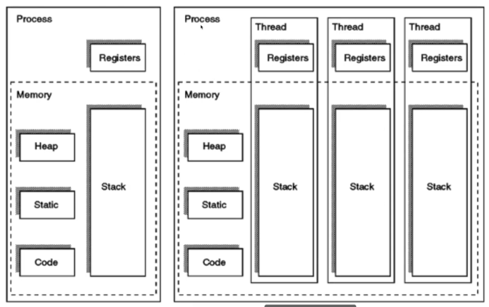

* 하나의 프로세스가 가지고 있는 메모리를 여러 개의 스레드가 공유함 
* 프로세스와 프로세스 간의 전환보다 스레드와 스레드 간 전환하는 비용이 더 적게 든다.

---

### 스레드 vs 프로세스
* 스레드는 프로세스 안에 존재하는 실행 흐름이다.
* 스레드는 프로세스의 heap, static, code 영역 등을 공유한다.
* 스레드는 stack 영역을 제외한 메모리 영역은 공유한다.
* 스레드가 code 영역을 공유하기 때문에 프로세스 내부의 스레드들은 프로세스가 가지고 있는 함수를 자연스럽게 모두 호출할 수 있다.
* 스레드는 IPC 없이도 스레드 간의 통신이 가능하다. A, B 스레드는 통신하기 위해 heap 영역에 메모리 공간을 할당하고, 두 스레드가 자유롭게 접근할 수 있다.

여러 개의 프로세스를 동시에 실행하는 프로그램보다, 스레드를 여러 개 동시에 실행하는 프로그램이 프로그래밍하기 훨씬 더 쉬움</br>
→ 멀티 프로세스 프로그래밍보다 멀티 스레드 프로그래밍이 쉽다</br>
(메모리가 많고 컴퓨터의 속도가 빠를 때에는 멀티 프로세스가 유리할 때도 있음)


* 스레드는 프로세스처럼 스케쥴링의 대상이다. 이 과정에서 컨텍스트 스위칭이 발생한다. 하지만 스레드는 공유하고 있는 메모리 영역 덕분에 컨텍스트 스위칭 때문에 발생하는 오버헤드가 프로세스에 비해 작다.
  * 동작중인 프로세스가 바뀔 때, 프로세스는 현재 자신의 상태(context 정보)를 일단 보존한 후, 새롭게 동작 개시하는 프로세스는 이전에 보존해 두었던 자신의 컨텍스트 정보를 다시 복구한다. 이와 같은 현상을 **컨텍스트 스위칭(Context Switching)** 이라 말한다.
  * 스레드의 컨텍스트 정보는 프로세스보다 적기 때문에 스레드의 컨텍스트 스위칭은 가볍게 행해지는 것이 보통이다.
  * 하지만, 실제로 스레드와 프로세스의 관계는 JVM 구현에 크게 의존한다.
* 참고로 플랫폼이 같아도 JVM의 구현방법에 따라 프로세스와 스레드의 관계는 달라질 수 있다. 


---

### 멀티 스레드(Multi Thread) 실행방식

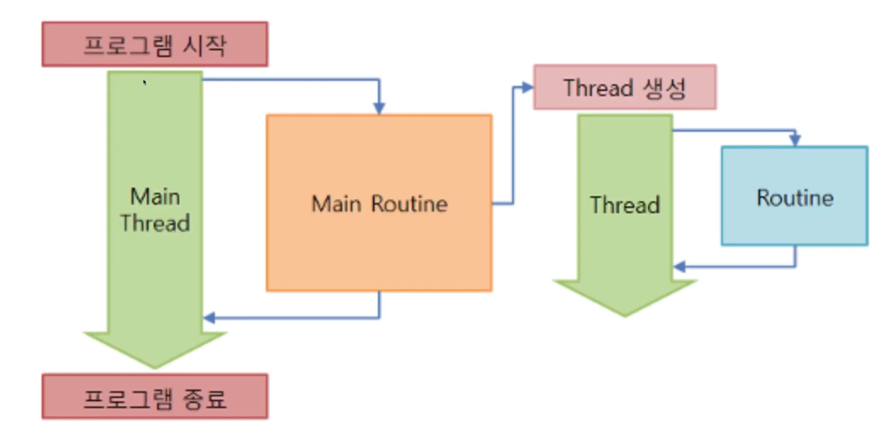

* 메인 메소드부터 시작해서 흘러가는 하나의 흐름을 메인 스레드(Main Thread) 라고 함.
* 멀티 스레드는 메인 스레드 메인 흐름 안에서 새로운 스레드를 발생시킬 수 있음</br>
***→ 동시에 여러 가지 흐름이 발생할 수 있음 (동시에 여러 가지 동작이 수행되게 할 수 있다. )***

---

### Thread 클래스를 상속받아 스레드 작성하기
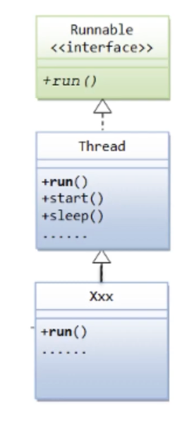

* 스레드를 만드는 방법 중 하나는 Thread 클래스를 상속받아 만드는 방법이 있다.
* Thread 클래스는 `run()` 이라는 메소드를 갖고 있는데, Thread 클래스를 상속받고 있는 클래스에서 반드시 `run()` 메소드를 오버라이딩 해줘야 한다.

1. Thread를 상속받고 있는 Xxx 클래스
```java
class Xxx extends Thread {
    // run() 메소드 오버라이딩
    public void run() {
        // 동시에 실행될 코드 작성
    }
}
```
인스턴스 생성 후 `start()` 메소드 호출
```java
Xxx x = new Xxx();
x.start();
```
`run()` 메소드를 오버라이딩 했지만, 실제 호출하는 메소드는 `start()` 메소드임!

### 예제 1
1. MyThreadExam 클래스
```java
public class MyThreadExam {
    public static void main(String[] args) {
        // 메인 메소드가 실행되면 무조건 메인 스레드가 하나 만들어짐!
        // currnetThread() 메소드는 현재 스레드 정보를 반환
        String name = Thread.currentThread().getName();
        System.out.println("thread name : " + name);
        System.out.println("start!");
        // 1초마다 * 를 10번 출력하는 프로그램을 작성하시오.
        for (int i = 0; i < 10; i++) {
            System.out.println("*");
            try {
                Thread.sleep(1000); // 1초간 쉰다 (1000 millis), 반드시 Exception 처리를 해줘야 함
            }catch (InterruptedException e){
                e.printStackTrace(); // Exception이 발생했을 떄, Exception 메세지만 출력하도록 하는 메소드
            }
        } // for 반복문 끝

        // 1초마다 + 를 10번 출력하는 프로그램을 작성하시오.
        for (int i = 0; i < 10; i++) {
            System.out.println("*");
            try {
                Thread.sleep(1000); // 1초간 쉰다 (1000 millis), 반드시 Exception 처리를 해줘야 함
            }catch (InterruptedException e){
                e.printStackTrace(); // Exception이 발생했을 떄, Exception 메세지만 출력하도록 하는 메소드
            }
        } // for 반복문 끝
        System.out.println("end!");
    }
}
```
2. 출력 결과 (1초마다 * 이 하나씩 출력되고 +이 하나씩 출력됨)
```text
thread name : main
start!
**********++++++++++
end!
```

### 예제 2 ( * 과 + 를 동시에 출력하고 싶다면?)

1. MyThread 클래스
```java
// 1. Thread 클래스를 상속받는다
public class MyThread extends Thread {
    // 필드 선언
    private String str;
    
    // 생성자 (String 을 받아들여 초기화)
    public MyThread(String str){
        this.str = str;
    }
    // 2. run() 메소드를 오버라이딩 한다.
    // 동시에 실행시키고 싶은 코드를 작성한다.
    @Override
    public void run() {
        String name = Thread.currentThread().getName();
        System.out.println("--- " + name + " ---");
        for (int i = 0; i < 10; i++) {
            System.out.println(str); // 생성자에 * 을 넣어주면 * 이 출력될 것이고, + 를 넣어주면 + 가 출력될 것임
                try {
                    Thread.sleep(1000); // 1초간 쉰다 (1000 millis), 반드시 Exception 처리를 해줘야 함
            }catch (InterruptedException e){
                e.printStackTrace(); // Exception이 발생했을 떄, Exception 메세지만 출력하도록 하는 메소드
            }
        } // for 반복문 끝
    }
}
```
2. MyThreadExam 클래스
```java
public class MyThreadExam {
    public static void main(String[] args) {
        String name = Thread.currentThread().getName();
        System.out.println("thread name : " + name);
        System.out.println("start!");
         
        // 3. 스레드 객체 생성
        MyThread mt1 = new MyThread("*");
        MyThread mt2 = new MyThread("+");
        
        // 4. thread는 start() 메소드로 실행한다.
        // start() 메소드를 만나게 되면 새로운 흐름이 시작됨
        mt1.start();
        mt2.start();
        
        System.out.println("end!");
    }
}
```
3. 출력 결과
```text
thread name : main
start!
end!
--- Thread-1 ---
+--- Thread-0 ---
*+*+*+*+*+*+*+*+*+*+
```
순서
```text
1. Thread 클래스를 상속받는다
2. run() 메소드를 오버라이딩 한다.
3. 스레드 객체 생성
4. thread는 start() 메소드로 실행한다.
```


* `main()` 메소드가 실행되면서 main 스레드가 실행이 됨
* 메인 스레드가 한줄 한줄 실행해 나가다가 `start()` 메소드를 만나게 되면 `mt1`에 해당하는 스레드가 발생하면서 `run()` 메소드가 실행됨 (흐름이 하나 더 생김)
* `run()`이 실행되는 도중에 main 스레드는 그 다음 줄인 `mt2`를 실행하게 되면서 `run()` 메소드가 실행되고, 계속해서 main 스레드는 또 그 다음 줄을 실행

→ 즉, 흐름이 3개가 되고 `main()` 메소드는 마지막으로 종료됨

***`start()` 메소드는 Thread 실행 할 준비를 해주고, `run()` 메소드를 실행해주며 흐름이 하나 더 생긴다!!***

이전까지는 main 메소드가 종료되면 프로그램이 끝난다는 것으로 알고 있었지만

이제는 ***"모든 스레드가 종료됐을 떄 프로그램이 종료된다"*** 로 알고 있어야 한다!!

---

### Runnable 인터페이스를 구현하여 스레드 작성하기

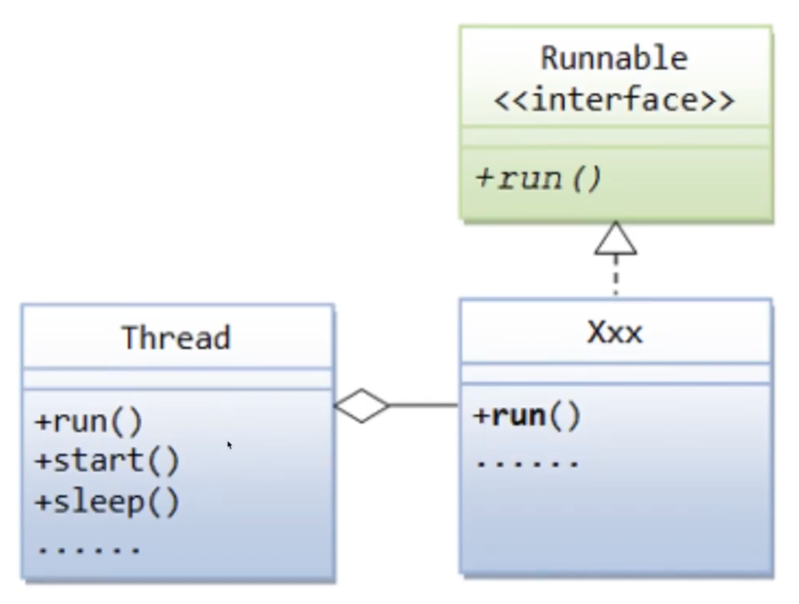

Runnable 인터페이스는 `run()` 메소드를 갖고 있음. Runnalbe 을 구현해주고 `run()` 메소드를 오버라이드 구현해주면 됨.

문제는 인터페이스이기 때문에 `start()` 메소드가 없음. `start()` 메소드는 Thread 클래스가 갖고 있음.

Runnalbe 인터페이스를 구현하여 클래스를 만들면, 이 구현한 클래스를 Thread가 가지도록 해야한다.

1. Runnable 인터페이스를 구현한 Xxx 클래스
```java
class Xxx implements Runnable {
    // run() 메소드 오버라이딩
    public void run() {
        // 동시에 실행될 코드 작성
    }
}
```
Xxx 클래스 인스턴스 생성 후, Thread 인스턴스 생성자에 넣어준 뒤, start() 메소드 호출
```java
Xxx x = new Xxx();
Thread t = new Thread(x);
t.start();
```
이 스레드는 자신이 갖고 있는 Runnable 객체의 run() 메소드를 호출해주면서 새로운 흐름을 만듦.


### 예제

```java
// 1. Runnable 인터페이스를 구현한다.
public class MyRunnable implements Runnable {
    // 필드 선언
    private String str;
  
    // 생성자 (String 을 받아들여 초기화)
    public MyThread(String str){
      this.str = str;
    }
    
    // 2. run() 메소드를 구현한다.
    @Override
    public void run() {
        String name = Thread.currentThread().getName();
        System.out.println("--- " + name + " ---");
        
        for (int i = 0; i < 10; i++) {
            System.out.println(str); // 생성자에 * 을 넣어주면 * 이 출력될 것이고, + 를 넣어주면 + 가 출력될 것임
            try {
                Thread.sleep(1000); // 1초간 쉰다 (1000 millis), 반드시 Exception 처리를 해줘야 함
            }catch (InterruptedException e){
                e.printStackTrace(); // Exception이 발생했을 떄, Exception 메세지만 출력하도록 하는 메소드
            }
        } // for 반복문 끝
    }
}
```
2. MyThreadExam2 클래스
```java
public class MyThreadExam {
    public static void main(String[] args) {
        String name = Thread.currentThread().getName();
        System.out.println("thread name : " + name);
        System.out.println("start!");
        
        // 3. Runnable 객체 생성
        MyRunnable mr1 = new MyRunnable("*");
        MyRunnable mr2 = new MyRunnable("+");
        
        // 4. Thread 인스턴스 생성하는데, 생성자에 Runnable 인스턴스를 넣어준다.
        Thread t1 = new Thread(mr1);
        Thread t2 = new Thread(mr2);
        
        // 5. Thread가 갖고 있는 start() 메소드를 호출한다.
        t1.start();
        t2.start();
      
        System.out.println("end!");
    }
}
```
3. 출력 결과 (실행하다 보면 스레드는 서로 자원을 획득해서 빨리 실행하고 싶어하기 때문에 실행되는 결과가 항상 똑같진 않음 * 이 먼저 출력될수도 + 가 먼저 출력될 수도 있음.)
```text
thread name : main
start!
end!
--- Thread-1 ---
+--- Thread-0 ---
++*+*+*+*+*+**+*++*
```
순서
```text
1. Runnable 인터페이스를 구현한다.
2. run() 메소드를 오버라이딩 한다.
3. Runnable 객체 생성
4. Thread 인스턴스 생성하는데, 생성자에 Runnable 인스턴스를 넣어준다.
5. Thread가 갖고 있는 start() 메소드를 호출한다.
```
<br/><br/>

>**Reference**
><br/>부부개발단 - 즐겁게 프로그래밍 배우기.