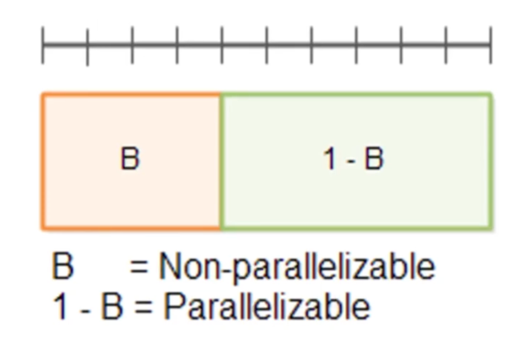
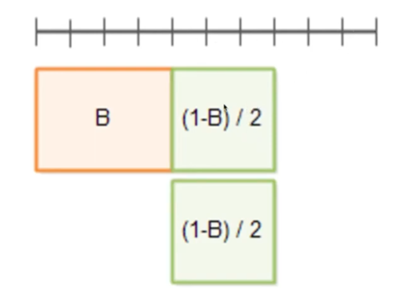
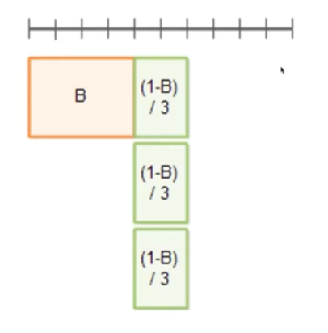
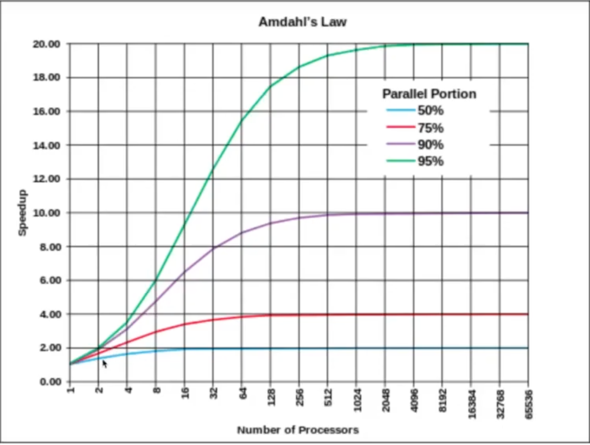

## 쓰레드 (Thread)

---

### 성능 향상시키기

B는 병렬화시킬 수 없는 부분(동시에 실행시킬 수 없는 부분)

1-B는 병렬화가 가능한 부분(동시에 실행이 가능한 부분)이라 했을 때
 

병렬화 가능한 부분을 2부분으로 나눌 수도 있고, (남은 3칸만큼 시간 향상)

3부분으로 나눌 수도 있다. (남은 4칸만큼 시간 향상)

병렬화 가능한 부분을 나눌 수록 더욱 더 많은 시간을 향상시킬 수 있음!

B라는 부분은 병렬화 가능하지 않은 부분(동시에 실행시킬 수 없는)이기 때문에 성능은 한없이 향상시킬 수는 없다.

→ 따라서, B부분에서는 성능이 떨어지는 문제가 발생할 수 있음!

---

### 병렬화 할 때 고려해야 할 것들

* 메모리의 속도
* CPU 캐시 메모리
* 디스크
* 네트워크
* 컨넥션
* 순차적 실행이 병렬실행보다 빠른 경우도 있다. 
  (동시 실행에 따르는 오버헤드가 없고, 단일 CPU 알고리즘은 하드웨어 작업에 더 친화적일 수 있기 때문)
* 기타

---

### 암달의 법칙 (Amdahl's Law)

* 암달의 저주로도 불리며 컴퓨터 시스템의 일부를 개선할 때, 전체적으로 얼마만큼의 최대 성능 향상이 있는지 계산하는데 사용된다.
* 론(theory)만 많은 컴퓨터 과학 분야에서 몇 안되는 법칙(Law)이다.

* 병렬 컴퓨팅을 할 경우, 일부 병렬화 가능한 작업들은 사실상 계산에 참여하는 컴퓨터의 개수에 비례해서 속도가 늘어난다. 
* 이러한 경우 암달의 법칙에 의해 전체 수행시간의 개선 효과는 병렬화가 불가능한 작업들의 비중에 크게 영향을 받게 된다.
* 즉, 아무리 컴퓨터 개수가 늘어나더라도 위의 그림에서 보는 것처럼 **속도의 한계는 정해져 있다는 것**

***병렬화가 불가능한 부분 때문에, 컴퓨터가 아무리 늘어나도 어느 순간에서는 성능이 더 이상 향상되지 못하는 경우가 있다 ❗️***

  

>**Reference**
> 부부개발단 - 즐겁게 프로그래밍 배우기.