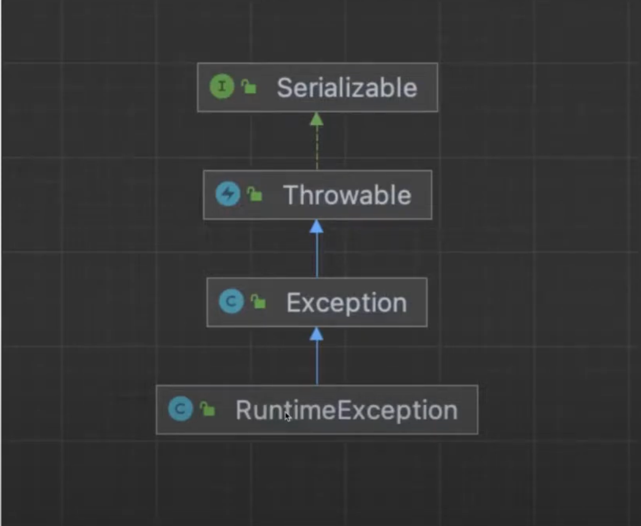
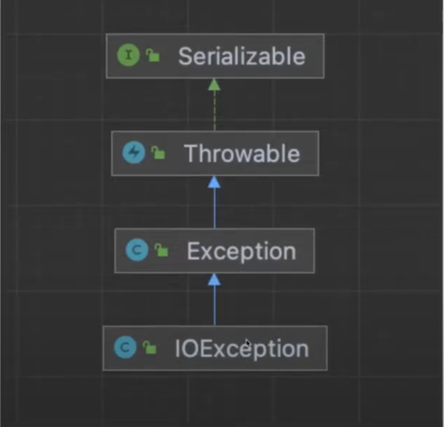

## 예외(Exception)처리

---
### Error의 종류
* 컴파일 에러 
  * 컴파일 시 발생하는 에러
* 런타임 에러
  * 실행 시 발생하는 에러 

---

### 자바에서 실행 시 발생하는 2가지 형태의 오류
* Error : 수습할 수 없는 심각한 오류
* Exception (예외) : 예외 처리를 통해 수습할 수 있는 덜 심각한 오류
* 메모리 부족, 스택오버플로우(stack overflow) 등이 발생하여 프로그램이 죽는 것은 프로그래머가 제어할 수 없다.

다음과 같은 클래스를 실행시켜보면
```java
public class Exception1 {
    public static void main(String[] args) {
        ExceptionObj1 exobj = new ExceptionObj1();
        int value = exobj.divide(10, 0);
        System.out.println(value);
    }
}
```
```java
public class ExceptionObj1 {
    public int divide(int i, int k){
        int value = 0;
        value = i / k;
        return value;
    }
}
```
이런 식으로 오류가 뜸 ( i(10)를 k(0)로 나누는데 0으로 나눌 수 없기 때문)</br>
JVM이 0으로 나눌 수 없기 때문에 `ArithmeticException`라는 객체를 생성하여 프로그램을 멈춤
```text
Exception in thread "main" java.lang.ArithmeticException ~~~~
at ExceptionObj1.divide(Exception1.java:12)
at Exception1.main(Exception1.java:4)
```

---

### 예외 처리하기 (`try-catch`)
`try` 블럭에 코드를 적고, 코드에서 어떤 Exception이 발생하게 되면 이 Exception을 처리해주는 로직을 `catch` 블럭에 적어주면 됨
```java
try{
    코드1
    코드2
        .......    
} catch(Exception클래스명1 변수명1){
        Exception을 처리하는 코드
} catch(Exception클래스명2 변수명2){
        Exception을 처리하는 코드
}
```

---

### 위의 예시에 `try-catch` 적용
```java
// B 사용자가 작성, A 사용자가 만든 ExceptionObj1을 이용한다.
public class Exception1 {
    public static void main(String[] args) {
        ExceptionObj1 exobj = new ExceptionObj1();
        int value = exobj.divide(10, 0);
        System.out.println(value);
    }
}
```
```java
// A 사용자가 작성
public class ExceptionObj1 {
    public int divide(int i, int k){
        int value = 0;
        try {
          value = i / k;    
        }catch (ArithmeticException ex){
          System.out.println("0으로 나눌 수 없습니다.");
          System.out.println(ex.toString());
        }
        
        return value;
    }
}
```
에러가 발생하지 않았기 때문에 `value`는 처음에 0으로 선언했던 0을 리턴
```text
0으로 나눌 수 없습니다.
java.lang.ArithmeticException: / by zero
0
```

### 위 클래스에서 찾아볼 수 있는 2가지 문제점 🤔
1. 오류는 발생하지 않았지만 0으로 나눴을 때 0이 나오면 안되는데 0을 리턴하게끔 하는 심각한 오류를 야기할 수 있는 점
2. 사용자(B)가 원하지 않는 메세지를 출력하게 한 점

❓ 여기서 10은 실제로 0으로 나눌 수가 없는데 0을 출력하도록 하는게 맞는 것인가 ❓</br>
❌ 잘못된 값을 리턴해준 것이므로 try-catch 적용 전 예시처럼 예외를 발생시키고 프로그램이 종료되게끔 하는 것이 좋음</br>

그리고 A라는 사용자는 `ExceptionObj1`이라는 클래스를 재사용되길 원했다면
```text
System.out.println("0으로 나눌 수 없습니다.");
System.out.println(ex.toString());
```
이런 식으로 아무렇게나 값을 출력하도록 하는 것은 바람직하지 않음!!

---

### 예외 떠넘기기(`throws`)
```java
리턴타입 메소드명( 아규먼트 리스트 ) throws Exception클래스명1, Exception클래스명2 ....{
        코드1 
        코드2
        .......
}
```

---

### 예외 떠넘기기(`throws`) 적용
`value = i / k;` </br>
이 부분에서 Exception(`ArithmeticException`)이 발생하는데 여기서 발생하는 Exceptino을 `divide()` 메소드에서 처리하지 않고 `divide()` 메소드를 호출하는 쪽에 떠넘길 수가 있음.</br>
그리고 `divide()` 메소드를 사용하는 쪽에서 `try-catch` 문을 사용하여 Exception을 처리해줘야 한다.
```java
// B 사용자가 작성, A 사용자가 만든 ExceptionObj1을 이용한다.
public class Exception1 {
    public static void main(String[] args) {
        ExceptionObj1 exobj = new ExceptionObj1();
        // ✅ 메소드를 사용하는 쪽에서 Exception 처리
        try {
          int value = exobj.divide(10, 0);
          System.out.println(value); // 0으로 나눌 수 없기 때문에 이 부분은 실행 ❌
        }catch (ArithmeticException ex){
          System.out.println("0으로 나눌 수 없습니다.");
        }
    }
}
```
```java
// A 사용자가 작성, 예외 떠넘기기를 이용하면 JavaDoc 주석문도 사용이 가능
public class ExceptionObj1 {
  /**
   * i를 k로 나는 나머지를 반환한다.
   * @param i
   * @param k
   * @return
   * @throws ArithmeticException
   */
    public int divide(int i, int k) throws ArithmeticException{ // ✅ 메소드를 호출하는 쪽에 throws
        int value = 0;
        value = i / k;
        return value;
    }
}
```
```text
0으로 나눌 수 없습니다.
```
A 사용자는 `ExceptionObj1` 클래스에 해당되는 api 도큐먼트를 제공, 도큐먼트에는 `divide()` 메소드가 `ArithmeticException`을 발생한다고 정의해놓음.</br>

B 사용자는 `ExceptionObj1` 클래스를 사용하는데 오류없이 실행되게끔 만드려면 `divide()` 메소드가 사용되는 곳을 `try-catch`로 묶어준 뒤, 메소드에서 발생할 수 있는 `ArithmeticException`를 처리해주면 됨!

---

### `RuntimeException`과 `Checked Exception`


`RuntimeException`
* 실행 시에 오류가 나서 프로그램이 종료되는 Exception, 특별한 경우에만 오류가 발생
* Exception 처리를 따로 해주지 않아도 컴파일이 가능
* `RuntimeException` 클래스를 상속받고 있는 Exception은 전부 `RuntimeException`이다.
* `ArithmeticException`도 `RuntimeException`에 해당



`Checked Exception`
* `RuntimeException`을 상속받지 않은 기본적인 `Exception`을 상속받고 있는 것들을 모두 `Checked Exception`이라고 함
* 중간에 `RuntimeException`을 상속받고 있다면 `Checked Exception`이 아님!
* `IOException`은 `Exception`을 상속받고 있기 때문에 `Checked Exception`에 해당

---

`Checked Exception` 예시
```java
import java.io.FileInputStream;

public class Exception4 {
    public static void main(String[] args) {
        // 컴파일 오류가 발생한다.
        FileInputStream fis = new FileInputStream("Exception4.java");
    }
}
```
올바른 처리
```java
import java.io.FileInputStream;

public class Exception4 {
    public static void main(String[] args) {
        try {
            // FileInputStream은 FileNotFoundException을 발생한다고 되어있고
            // FileNotFoundException Checked Exception을 상속받고 있기 때문에 반드시 Exception 처리를 해줘야 함❗️
            FileInputStream fis = new FileInputStream("Exception4.java");
        }catch (FileNotFoundException fnfe){
            System.out.println("파일을 찾을 수 없습니다.");
        }
    }
}
```

나만의 Exception을 만든다면 RuntimeException vs Checked Exception 둘 중 어느 것을 상속받는 것이 좋을까❓</br>
✅ Checked Exception은 되도록 만들지 않는 것이 좋음. RuntimeException을 상속받고 있는 클래스를 만드는 것이 좋음 !</br>
✅ Checked Exception이 많아지면 처리할 것이 굉장히 많아지기 때문, RuntimeException을 상속받는 Exception을 만들어서 사용자가 알아서 Exception을 처리할 수 있도록 하는 것이 좋음!


---

### 다중 Exception 처리

예시 1
```java
public class Exception6 {
    public static void main(String[] args) {
          int[] array = {4, 0};
          int[] value = null;
          try {
              value[0] = array[0] / array[1];
          }catch (ArrayIndexOutOfBoundsException aiob){
            System.out.println(aiob.toString());
          }catch (ArithmeticException ae){
            System.out.println(ae.toString());
          }catch (Exception ex){
            System.out.println(ex);
        }
    }
}
```
4 (배열 0번째 값)를 0 (배열 1번째 값) 로 나눠서 value[0]에 넣으려고 했는데 4는 0으로 나눌 수가 없음!</br>
**→ ArithmeticException 발생**
```text
java.lang.ArithmeticException: / by zero
```

예시 2
```java
public class Exception6 {
    public static void main(String[] args) {
          int[] array = {4, 2};
          int[] value = null;
          try {
              value[0] = array[0] / array[1];
          }catch (ArrayIndexOutOfBoundsException aiob){
            System.out.println(aiob.toString());
          }catch (ArithmeticException ae){
            System.out.println(ae.toString());
          }catch (Exception ex){
            System.out.println(ex);
        }
    }
}
```
4 (배열 0번째 값)를 2 (배열 1번째 값) 로 나눠서 value[0]에 넣으려고 했는데, value 자체가 null을 참조하고 있기 때문에 값을 넣을 수 가 없음!</br>
**→ NullPointException 발생 (Exception의 후손 인스턴스이기 때문에 참조 가능)**
```text
java.lang.NullPointException
```
예시 2 NullPointException 해결 방법
```java
public class Exception6 {
    public static void main(String[] args) {
          int[] array = {4, 2};
          // ✅ 1개를 담을 수 있는 배열을 선언한다.
          int[] value = new int[1];
          try {
              value[0] = array[0] / array[1];
          }catch (ArrayIndexOutOfBoundsException aiob){
            System.out.println(aiob.toString());
          }catch (ArithmeticException ae){
            System.out.println(ae.toString());
          }catch (Exception ex){
            System.out.println(ex);
        }
    }
}
```
예시 3
```java
public class Exception6 {
    public static void main(String[] args) {
          int[] array = {4};
          int[] value = new int[1];
          try {
              value[0] = array[0] / array[1];
          }catch (ArrayIndexOutOfBoundsException aiob){
            System.out.println(aiob.toString());
          }catch (ArithmeticException ae){
            System.out.println(ae.toString());
          }catch (Exception ex){
            System.out.println(ex);
        }
    }
}
```
array[0]에 대한 값은 있지만 array[1]에 대한 값이 없음, array 범위를 벗어났기 때문에</br>
**→ ArrayIndexOutOfBoundsException 발생!**
```text
java.lang.ArrayIndexOutOfBoundsException: Index 1 out of bounds for length 1
```

---

### 사용자 정의 Exception과 예외 발생시키기(throw)
```java
public class MyException extends RuntimeException {
    // 오류 메시지나, 발생한 Exception을 감싼 결과로 내가 만든 Exception을 사용하고 싶을 때가 많다.
  
    // 문자열을 받는 생성자 (message를 전달해주면 부모(RuntimeException)에게 그대로 전달)
    public MyException(String message){
        super(message);
    }
    
    // Throwable을 받는 생성자 (Throwable은 또 다른 Exception이나 RuntimeException을 받아들일 수 있음)
    public MyException(Throwable cause){
        super(cause);
    }
}
```
```java
public class Exception7 {
    public static void main(String[] args) {
        try {
            ExceptionObj7 exobj = new ExceptionObj7();
            int value = exobj.divide(10, 0); // ✅ 메소드를 사용해주는 쪽에서 Exception 처리
            System.out.println(value);
        }catch (MyException ex){
            System.out.println("사용자 정의 Exception이 발생했네요.");
        }
    }
}

class ExceptionObj7 {
    public int divide(int i, int k) throws MyException{
        int value = 0;
        try {
            value = i / k;
        }catch (ArithmeticException ae){
            throw new MyException("0으로 나눌 수 없습니다."); // ✅ MyException을 new로 생성하여 throw
        }
        return value;
    }
}
```
원래 i / k 라고 하면 k = 0일 때는 0으로 나눌 수 없기 때문에</br>
JVM이 ArithmeticException라는 인스턴스를 생성하여 try 쪽에서 throw 해주면서 catch로 받아들이는데</br>
catch로 받은 것을 프로그래머가 MyException 이라는 것을 new로 생성하면서 throw 해준 것</br>
그리고 divide() 로 호출해주는 쪽에 넘겨줌

즉, JVM이 try쪽에서 throw 해준 것을 프로그래머가 만든 MyException 으로 다시 Exception을 재생성하여 발생하게 한 것
그리고 그 메소드를 사용하는 쪽은 MyException을 처리해줘야 함

<br/><br/>

>**Reference**
><br/>부부개발단 - 즐겁게 프로그래밍 배우기.