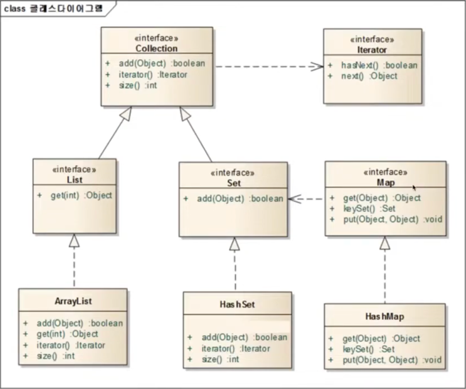

## 제네릭(generic)

---
### 제네릭(generic)
`<T>`는 제네릭과 관련된 부분이다.</br>
제네릭은 클래스 이름 뒤, 메소드 리턴 타입 앞에 붙을 수 있다.</br>
`<T>`부분은 T라는 이름의 제네릭 타입을 선언한다는 것을 의미한다.</br>
T는 Type의 약자이며 꼭 T를 쓸 필요는 없음.</br>

### 제네릭 장점
정해진 타입만 사용하도록 강제할 수 있다.</br>
타입을 강제함으로써 컴파일할 때 잘못된 타입의 값이 저장되는 것을 막을 수 있다.</br>
예를 들어, 문자열만 받도록 해놓으면 사용자는 문자열만 넣어야 함.


1. ObjectBox 클래스 (어떤 타입이든 담을 수 있는 상자)
```java
public class ObjectBox {
    private Object object;
    
    // getter, setter 메소드
    public void set(Object obj) {
        this.object = obj;
    }

    public Object get() {
        return this.object;
    }
}
```
2. ObjectBoxMain 클래스
```java
public class ObjectBoxMain {
    public static void main(String[] args) {
        ObjectBox box = new ObjectBox();
        box.set("kim");
        // String 타입으로 형변환
        String str = (String) box.get();
        System.out.println(str.toUpperCase());
        
        box.set(new Integer(5));
        Integer i = (Integer) box.get();
        System.out.println(i.intValue());
    }
}
```
```text
KIM
5
```

ObjectBox 는 Object 타입을 가질 수 있기 때문에 Object의 후손들이 들어갈 수 있다.</br>
하지만, 꺼낼 때는 Object 타입으로 리턴해주기 때문에 원래 타입으로 형변환을 해줘야 함 → 너무 번거로움 😠</br>
**→ 이래서 나온 것이 제네릭(generic)**
1. GenericBox 클래스
```java
// ✅ Generic이라는 클래스는 T라는 이름의 아직 정해지지 않은 타입을 쓰겠다라는 의미
public class GenericBox<T> {
    // 아직 정해져 있지 않은 T타입
    private T t;
    
    public void add(T obj){
        this.t = obj;
    }
    
    public T get(){
        return this.t;
    }
}
```
2. GenericBoxMain 클래스
```java
public class GenericBoxMain {
    public static void main(String[] args) {
        // ✅ T라는 아직 정해져 있지 않은 타입을 String 타입으로 쓰겠다 라는 의미 → 형 변환이 따로 필요 없음 😀
        GenericBox<String> genericBox = new GenericBox<>();
        genericBox.add("kim");
        String str = genericBox.get();
        System.out.println(str.toUpperCase());
        
//        genericBox.add(new Integer(5)); 이건 컴파일 오류가 발생 
//        이유❓ 이미 위에서 String만 담을 수 있는 genericBox로 선언했기 때문
        
        // Integer 타입을 담으려면 다시 선언해줘야 함
        GenericBox<Integer> intBox = new GenericBox<>();
        genericBox.add(new Integer(5));
        Integer intValue = intBox.get();
        System.out.println(intValue);
    }
}
```
```text
KIM
5
```
***generic 이라는 문법을 사용하게 되면 내가 원하는 타입을 지정할 수가 있으며 받고 리턴할 수가 있다!!!***</br>

---

### 컬렉션 프레임워크(Collection Framework)

**자료(Data)를 다룰 때 반드시 필요한 클래스의 모음</br>**
**5가지 인터페이스 (Collection, Iterator, List, Set, Map)**

 


---

### Collection 인터페이스
여기에 자료가 있다라는 것을 표현하는 인터페이스, 바구니</br>
컬렉션 프레임워크에서 가장 기본이 되는 인터페이스</br>
**해당 인터페이스는 순서를 기억하지 않고, 중복을 허용하여 자료를 다루는 목적으로 만들어짐**
- `add(Object) : boolean` 메소드 (물건을 담는)</br>
- `size() : int` 메소드 (물건이 몇 개 있는지?)</br>
- `iterator() : Iterator` 메소드 (바구니에 물건을 집어 넣었지만 순서를 기억 못함 → `iterator()` 메소드 활용)

---

### Iterator 인터페이스
물건을 꺼내는 인터페이스</br>
자료구조에서 자료를 꺼내기 위한 목적으로 사용되는 인터페이스</br>
Iterator 패턴을 구현하고 있다.</br>
모든 것을 꺼내기 위한 패턴(디자인 패턴)</br>
- `hasNext() : boolean` 메소드 (꺼낼 것이 있는지 없는지?)</br>
- `next() : Object` 메소드 (하나를 꺼낸다, 다음 것을 꺼낸다)</br>
- `hasNext()`로 꺼낼 것이 있는지 확인 후, `next()`로 꺼냄

Collection은 어떠한 값이 있다라는 것만 표현하고 순서 자체를 기억 못함.</br>
→ Collection 에 들어있는 것을 다 꺼내기 위해서는 Iterator를 리턴해주는데 그것을 이용해 꺼냄</br>
**→ Collection은 모든 것을 꺼내기 위해 Iterator에 의존한다❗️❗️❗️**

---

### List 인터페이스 (Collection을 상속)
물건을 담아두기 위한 인터페이스</br>
**순서를 기억하는 자료구조(데이터를 저장할 수 있는 객체)**</br>
순서가 중요한 자료를 다룰 때 사용하는 인터페이스</br>
Collection을 상속받음으로써 Collection이 갖고 있는 `add()`, `size()`, `iterator()` 메소드를 사용할 수 있다.</br>
해당 인터페이스는 순서를 알고 있다고 가정하기 때문에 특정 순서로 저장된 자료를 꺼낼 수 있는 `get(int)` 메소드를 갖고 있다.</br>
몇 번째 추가된 자료인지 알 수가 있음
- Collection을 상속받고 있기 때문에, `add()`, `iterator()`, `size()` 메소드를 갖고 있음
- `get(int) : Object` 메소드 (순서를 기억하기 때문에 순서를 받아들여 꺼낸다)

### ArrayList (List 인터페이스를 구현하고 있는 클래스)

- `add(Object) : boolean` 메소드
- `get(int) : Object` 메소드
- `iterator() : Iterator` 메소드
- `size() : int` 메소드

---

### Set 인터페이스 (Collection을 상속)
**중복을 허용하지 않는 자료구조**</br>
중복을 허용하지 않는 자료를 다룰 때 사용하는 인터페이스</br>
중복을 허용하지 않는다는 것은 같은 값을 저장할 수 없다는 것</br>
같은 값을 여러 번 추가하여도 마지막 값 하나만 저장됨을 의미</br>
1 ~ 10까지 3번 연속 저장하려 함(1, 1, 1, 2, 2, 2 ... 10, 10, 10) → 하지만 1 ~ 10까지 10개의 데이터만 저장됨 (1, 2, 3 ... 10)</Br>
Set 인터페이스에 저장되는 객체들은 Object가 가지고 있는 `equal()`메소드와 `hashCode()`메소드를 오버라이딩 해야한다.
- `add(Object) : boolean` 메소드 (물건을 담는)

### HashSet (Set 인터페이스를 구현하고 있는 클래스)

- `add(Object) : boolean` 메소드
- `iterator() : Iterator` 메소드
- `size() : int` 메소드

---

### Map 인터페이스
**Key와 Value(값)로 구성되어 있는 자료구조**</br>
키(Key)와 값(Value)를 함께 저장하기 위한 목적으로 만들어진 인터페이스</br>
같은 Key값으론 하나의 값만 저장할 수 있다.
- `put(Object, Object) : void` 메소드 (첫 번째 파라미터는 Key값, 두 번쨰 파라미터는 Value값)
- `get(Object) : Object` 메소드 (파라미터로 Key값을 넣으면 Key에 해당하는 Value값을 리턴, Key에 해당하는 값이 없으면 null 리턴)
- `keySet() : Set` 메소드 (`put(Object, Object)` 메소드로 여러 건을 저장하게 되면, Key값들만 모아놓은 Set을 리턴 → 중복을 허용하지 않음)

Set안에 들어있는 모든 Key값을 꺼내고 싶으면❓</br>
→ Set의 부모인 Collection이 갖고 있는 Iterator를 이용(`hasNext()`, `next()`)하여 모든 Key를 꺼낼 수 있음.

### HashMap (Map 인터페이스를 구현하고 있는 클래스)

- `get(Object) : Object` 메소드
- `keySet() : Set` 메소드
- `put(Object, Object) : void` 메소드

---

### 제네릭을 사용하지 않고 ArrayList 사용하기
```java
import java.util.ArrayList;

public class ListExam01 {
    public static void main(String[] args) {
        // 자료구조 객체들은 제네릭을 사용하지 않으면 Object 타입을 저장
        ArrayList list = new ArrayList();
        list.add("kim");
        list.add("lee");
        list.add("hong");
        
        // Object 타입을 저장하기 때문에 String 타입으로 형 변환
        String str1 = (String) list.get(0);
        String str2 = (String) list.get(1);
        String str3 = (String) list.get(2);

        System.out.println(str1);
        System.out.println(str2);
        System.out.println(str3);
    }
}
```
```text
kim
lee
hong
```

### 제네릭과 함께 ArrayList 사용하기
```java
import java.util.ArrayList;

public class ListExam02 {
    public static void main(String[] args) {
        // 제네릭을 사용하여 ArrayList가 String 타입을 갖겠다고 선언
        ArrayList<String> list = new ArrayList<>();
        list.add("kim");
        list.add("lee");
        list.add("hong");
        
        // 형 변환 해줄 필요 없이 바로 String 타입으로 받을 수가 있음
        String str1 = list.get(0);
        String str2 = list.get(1);
        String str3 = list.get(2);

        System.out.println(str1);
        System.out.println(str2);
        System.out.println(str3);
    }
}
```
```text
kim
lee
hong
```

---

### Collection & Iterator

```java
import java.util.ArrayList;

public class ListExam03 {
    public static void main(String[] args) {
        // ArrayList 객체를 생성하는데 참조하는 타입은 Collection이며 String 타입을 갖겠다고 선언
        // ArrayList는 List 인터페이스를 구현하며, List 인터페이스는 Collection을 상속받고 있기 때문에 가능 
        // ❗️메소드는 참조하는 타입의 메소드만 사용 가능
        Collection<String> collection = new ArrayList<>();
        collection.add("kim");
        collection.add("lee");
        collection.add("hong");

        System.out.println(collection.size());
        
//        collection.get(0); → 이 메소드는 사용 불가 🚫
        
        // ✅ Collection이 갖고 있는 모든 것을 꺼내기 위해서는 Collection이 갖고 있는 iterator() 메소드를 사용해야 함
        
        // iterator() 메소드를 사용하게 되면 Collection에 있는 것을 전부 꺼낼 수 있는 타입인 Iterator가 리턴
        Iterator<String> iter = collection.iterator();
        
        // hasNext() 메소드를 통해 꺼낼 것이 있는지 확인 → add() 메소드로 이미 위에서 3건의 데이터를 넣은 상태
        while (iter.hasNext()){
            String str = iter.next(); // str은 3건의 문자열 중 하나의 꺼낸 값을 갖게 됨
            System.out.println(str);
        }
    }
}
```
```text
3
kim
lee
hong
```
위의 결과 값에서 Collection은 순서를 기억하지 못한다고 했는데 저장한 순서대로 출력되는 이유❓</br>
→ ✅ Collection을 구현하고 있는 것이 ArrayList이기 때문❗️</br>
실제로 iterator() 메소드는 ArrayList가 오버라이딩하여 구현하고 있기 때문에 순서대로 꺼내볼 수 있도록 Iterator 객체가 내부적으로 리턴이 되는 것임

아래 예시처럼 ArrayList 객체가 아닌 HashSet 객체를 생성한다고 하면 순서를 기억하지 못한 체 출력이 될 것임❗️
```java
import java.util.*;

public class ListExam03 {
    public static void main(String[] args) {
        Collection<String> collection = new HashSet<>();
        collection.add("kim");
        collection.add("lee");
        collection.add("hong");

        System.out.println(collection.size());
        
        Iterator<String> iter = collection.iterator();
        while (iter.hasNext()){
            String str = iter.next();
            System.out.println(str);
        }
    }
}
```
kim, lee hong은 순서가 계속 바뀌며 출력됨
```text
3
hong
lee
kim
```

***List를 구현하고 있는 객체를 제외하고는 어떤 순서로 나올 지 알 수가 없음!!!***
```java
Collection<String> collection = new ArrayList<>();
Collection<String> collection = new HashSet<>();
        ...
```
Collection을 구현하고 있는 자료구조들은 전부 다 올 수 있음</br>
**Collection을 사용할 때는 뒤에 있는 인스턴스가 무엇이든, 사용하고자 하는 목적의 인터페이스 타입으로 참조하여 사용하도록 하여야 함!!!**</br>

**앞에는 인터페이스 타입, 뒤에 인스턴스를 만드는 것은 클래스 타입</br>**

***인터페이스 타입으로 프로그래밍하도록 노력하는 습관을 들이자!!***</br>
***→ 그러기 위해선 인터페이스를 먼저 선언해야함!***

---

### List 예시

```java
import java.util.*;

public class ListExam02 {
    public static void main(String[] args) {
        List<String> list = new ArrayList<>();
        list.add("kim");
        list.add("lee");
        list.add("hong");

        String str1 = list.get(0);
        String str2 = list.get(1);
        String str3 = list.get(2);

        System.out.println(str1);
        System.out.println(str2);
        System.out.println(str3);
    }
}
```
```text
lee
kim
hong
```

---

### Set 예시 1
```java
import java.util.*;

public class SetExam01 {
    public static void main(String[] args) {
        Set<String> set = new HashSet<>();
        set.add("hello");
        set.add("hi");
        set.add("hong");
        set.add("hong");
        
        Iterator<String> iter = set.iterator();
        while (iter.hasNext()){
            String str = iter.next();
            System.out.println(str);
        }
    }
}
```
Set은 순서를 기억 못하기 때문에 뒤죽박죽 나옴, 중복을 허용하지 않기 때문에 hong도 한번만 출력
```text
hong
hi
hello
```
add 메소드는 boolean 값을 리턴해주기도 함 → 중복인지 아닌지 판단할 때 유용
```java
import java.util.*;

public class SetExam02 {
    public static void main(String[] args) {
        Set<String> set = new HashSet<>();
        boolean flag1 = set.add("hello");
        boolean flag2 = set.add("hi");
        boolean flag3 = set.add("hong");
        boolean flag4 = set.add("hong");

        System.out.println(flag1);
        System.out.println(flag2);
        System.out.println(flag3);
        System.out.println(flag4);
    }
}
```
hong이 중복된 값이므로 마지막에서 false 출력
```text
true
true
true
false
```
----
### Set 예시 2

1. MyData 클래스 (불변 객체)
```java
public class MyData {
    private String name;
    private int value;

    public MyData(String name, int value) {
        this.name = name;
        this.value = value;
    }
    
    public String getName() {
        return name;
    }

    public int getValue() {
        return value;
    }
    
    // toString 메소드를 구현하지 않으면 출력할 때 객체가 참조하는 값이 출력됨 
    // 아래 예시로 예로 들면 MyData@2752f6e2 이런 식으로 출력
    @Override
    public String toString() {
        return "MyData{" +
                "name'" + name + '\'' +
                ", value=" + value +
                '}';
    }
}
```
2. SetExam03 클래스
```java
public class SetExam03 {
    public static void main(String[] args) {
        Set<MyData> mySet = new HashSet<>();
        
        mySet.add(new MyData("kim", 500));
        mySet.add(new MyData("lee", 200));
        mySet.add(new MyData("hong", 700));
        mySet.add(new MyData("hong", 700));

        Iterator<MyData> iterator = mySet.iterator();
        while (iterator.hasNext()){
            MyData myData = iterator.next();
            System.out.println(myData);
        }
    }
}
```
3. 출력 결과
```text
MyDate{name='lee', value=200}
MyDate{name='hong', value=700}
MyDate{name='hong', value=700}
MyDate{name='kim', value=500}
```
<br/><br/>

>**Reference**
><br/>부부개발단 - 즐겁게 프로그래밍 배우기.